# De burger centraal: Introductiehandboek Zaakgericht Werken voor de Nederlandse Overheid

**Ilionx-handboek voor medewerkers**  
**Slogan:** Samen naar een goed geïnformeerd Nederland  
**Positionering:** ilionx is dé (technologie) partner die burgers, bedrijven en overheid met elkaar verbindt  
**Doelgroep:** alle medewerkers  
**Toon:** toegankelijk, professioneel, technisch-bestuurlijk  
**Vorm:** volledig Markdown, geen HTML

---

# Leeswijzer

> **Kernboodschap**  
> Dit handboek helpt iedere ilionx-medewerker om zaakgericht werken in de Nederlandse overheid te begrijpen én uit te leggen: bestuurlijk, juridisch, informatiekundig en technisch.

Dit handboek gebruikt de **Gouden Cirkel** van Simon Sinek als rode draad:

- **Waarom** — waarom zaakgericht werken nodig is
- **Hoe** — hoe het wordt ingericht met kaders, architectuur en standaarden
- **Wat** — welke producten, platformen en koppelingen dat mogelijk maken

Door het hele document loopt één concrete casus mee:

## Casus: de horeca-exploitatievergunning

Deze casus is bewust gekozen omdat zij herkenbaar is voor gemeenten en goed laat zien wat het verschil is tussen:

- een **Zaak**: het proces van aanvraag, beoordeling, besluitvorming en bekendmaking
- een **Object**: het recht, de vergunning, de inrichting, de ondernemer of het pand
- een **Registratie**: het administratief vastleggen van een gegeven
- een **Case / Dossier**: de samenhangende bundeling van informatie over een onderwerp of rechtsverhouding

---

# Inhoudsopgave

1. Inleiding: de burger centraal  
2. Waarom: vertrouwen, transparantie en rechtmatigheid  
3. Waarom: wet- en regelgeving als fundament  
4. De casus als rode draad: horeca-exploitatievergunning  
5. Zaak, registratie, object en case: scherpe definities  
6. Hoe: architectuurkaders voor de overheid  
7. Hoe: standaarden voor duurzame informatiehuishouding  
8. NEN 2084:2024 volledig uitgewerkt  
9. Datagedreven werken en Common Ground  
10. Immutable audit trails en bewijsvoering  
11. Wat: softwarelandschap voor zaakgericht werken  
12. ZGW API’s als lijm voor interoperabiliteit  
13. IBM-stack: FileNet en CP4BA  
14. Microsoft-stack: M365 in de overheidscontext  
15. OneGov en de rol van ilionx  
16. e-Depot, archivering en overbrenging  
17. Woo, openbaarheid en actieve publicatie  
18. Toegankelijkheid, inclusie en digitale dienstverlening  
19. UWV en de Verandermotor  
20. ilionx Overheid: strategische partner in de publieke sector  
21. Implementatie-aanpak voor medewerkers en organisaties  
22. Praktische valkuilen en ontwerpprincipes  
23. Samenvatting per rol  
24. Slotbeschouwing: van zaakgericht werken naar bestuurlijk betrouwbare uitvoering  

### Bijlagen

- **Bijlage A** — Lexicon  
- **Bijlage B** — Beslisboom  
- **Bijlage C** — Zelftest  

---

# Hoe dit handboek gelezen kan worden

Dit handboek kan op drie manieren worden gebruikt:

## 1. Als introductie voor alle medewerkers

Voor medewerkers die nieuw zijn in het overheidsdomein biedt dit handboek een breed en samenhangend overzicht van:

- de bestuurlijke context,
- de juridische randvoorwaarden,
- de informatiekundige begrippen,
- en de technologische bouwstenen.

## 2. Als naslagwerk per onderwerp

Voor medewerkers die al actief zijn in projecten, aanbestedingen, architectuurtrajecten of implementaties, kan het handboek ook hoofdstuksgewijs worden gebruikt. Denk aan:

- Woo en informatiehuishouding,
- M365 in de overheidscontext,
- IBM FileNet / CP4BA,
- ZGW API’s,
- of archivering en e-depots.

## 3. Als gemeenschappelijke taal binnen ilionx

Het handboek is ook bedoeld als intern referentiekader. Het helpt om dezelfde taal te spreken over begrippen als:

- zaak,
- object,
- registratie,
- dossier,
- metadata,
- duurzame toegankelijkheid,
- audit trail,
- en interoperabiliteit.

Dat voorkomt dat teams langs elkaar heen praten of leverancierstaal overnemen zonder publieke duiding.

---

# Wat dit handboek nadrukkelijk niet is

Dit handboek is:

- **geen** productbrochure,
- **geen** zuiver technisch implementatiehandboek,
- **geen** juridisch commentaar per wetsartikel,
- **geen** HR-document,
- **geen** handleiding voor één specifiek platform.

Het is wél een inhoudelijk handboek dat medewerkers helpt begrijpen hoe publieke opgaven, informatiehuishouding, architectuur en technologie samenkomen.

---

# Gebruik van visualisaties

Waar logisch zijn in dit handboek **Mermaid-diagrammen** toegevoegd. Die visualisaties zijn niet decoratief, maar bedoeld om samenhang te verduidelijken, bijvoorbeeld bij:

- procesflows,
- architectuurkaders,
- API-landschappen,
- audit trails,
- implementatiefasen,
- en beslisbomen.

---

# Gebruik van bronnen

Waar relevant bevat het handboek verwijzingen naar officiële bronnen, zoals:

- [wetten.overheid.nl](https://wetten.overheid.nl/)
- [overheid.nl](https://www.overheid.nl/)
- [NORA Online](https://www.noraonline.nl/)
- [GEMMA Online](https://www.gemmaonline.nl/)
- [Nationaal Archief](https://www.nationaalarchief.nl/)
- [Digitale Overheid](https://www.digitaleoverheid.nl/)
- [Autoriteit Persoonsgegevens](https://www.autoriteitpersoonsgegevens.nl/)
- [Europese Commissie](https://commission.europa.eu/)

Deze bronnen zijn bedoeld als verdieping en verificatie.

---

# Leesadvies per rol

| Rol | Aangeraden startpunt |
|---|---|
| Nieuwe medewerker | Hoofdstuk 1 t/m 5 |
| Informatieadviseur / architect | Hoofdstuk 5 t/m 12 |
| Consultant / projectleider | Hoofdstuk 1 t/m 6, 15, 20, 21, 22 |
| Jurist / Woo / archiefspecialist | Hoofdstuk 3, 7, 8, 10, 16, 17 |
| Technisch specialist | Hoofdstuk 9 t/m 15, 21, 22 |
| Manager / opdrachtgever | Hoofdstuk 1, 2, 6, 20, 21, 24 |

---

# Visueel overzicht van de opbouw

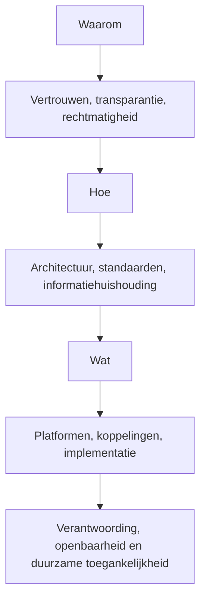

---

# Hoofdstuksamenvatting

> **Hoofdstuksamenvatting**  
> Dit bestand biedt de leeswijzer en inhoudsopgave van het handboek. De centrale lijn is dat zaakgericht werken geen doel op zich is, maar een middel om publieke dienstverlening, besluitvorming, informatiehuishouding en verantwoording in samenhang te organiseren. De horeca-exploitatievergunning vormt daarbij de rode casus die helpt om kernbegrippen en ontwerpkeuzes concreet te maken.
>
> # 1. Inleiding: de burger centraal

> **Kernboodschap**  
> Zaakgericht werken is geen doel op zich. Het is een middel om burgers en bedrijven beter, transparanter, voorspelbaarder en rechtmatiger te bedienen.

## 1.1 Waarom dit handboek bestaat

Binnen de Nederlandse overheid is de informatiehuishouding al jaren een strategisch thema. Niet alleen omdat systemen verouderen of processen inefficiënt zijn, maar vooral omdat de overheid moet kunnen aantonen:

- wat zij doet,
- waarom zij dat doet,
- op basis waarvan zij besluiten neemt,
- welke informatie daarbij is gebruikt,
- hoe rechten van burgers zijn gewaarborgd,
- en hoe die informatie duurzaam toegankelijk blijft.

Dat raakt direct aan:

- burgervertrouwen
- rechtsstatelijkheid
- dienstverlening
- transparantie
- archivering
- digitale duurzaamheid
- interbestuurlijke samenwerking

Zaakgericht werken staat precies op dit snijvlak. Het verbindt proces, informatie, besluitvorming, dienstverlening en verantwoording.

Voor ilionx-medewerkers is dit essentieel. ilionx opereert in het hart van overheidsvernieuwing: tussen beleid en uitvoering, tussen legacy en modernisering, tussen procesinrichting en technologiekeuze. Medewerkers moeten daarom niet alleen weten hoe een systeem werkt, maar vooral welk bestuurlijk en juridisch probleem ermee wordt opgelost.

## 1.2 De burger centraal als vertrekpunt

De overheid werkt niet voor systemen, maar voor mensen. Burgers en bedrijven verwachten dat de overheid:

- duidelijk is over procedures,
- voorspelbaar handelt,
- zorgvuldig omgaat met gegevens,
- besluiten kan uitleggen,
- stukken kan terugvinden,
- fouten kan herstellen,
- en informatie toegankelijk houdt.

Zaakgericht werken helpt daarbij, omdat een overheidsorganisatie per zaak inzichtelijk maakt:

- wat de aanleiding is,
- wie betrokken zijn,
- welke stappen zijn gezet,
- welke documenten en gegevens zijn gebruikt,
- welke termijnen gelden,
- welk besluit is genomen,
- welke rechtsgevolgen dat besluit heeft,
- en hoe het dossier duurzaam wordt bewaard.

## 1.3 Waarom dit voor ilionx relevant is

Voor ilionx is zaakgericht werken geen niche-onderwerp. Het raakt direct aan de rol van ilionx als partner van de overheid. De positionering:

**Samen naar een goed geïnformeerd Nederland**

vraagt dat medewerkers begrijpen hoe publieke dienstverlening, informatiehuishouding en technologie samenhangen.

De claim dat **ilionx burgers, bedrijven en overheid met elkaar verbindt** krijgt pas echt betekenis wanneer medewerkers kunnen uitleggen:

- waarom een overheid informatie op orde moet hebben,
- hoe wetgeving doorwerkt in processen en systemen,
- waarom zaak, object, registratie en dossier niet hetzelfde zijn,
- en hoe technologie pas waarde krijgt als zij bestuurlijk betrouwbaar is ingericht.

## 1.4 Zaakgericht werken als bestuurlijk principe

Zaakgericht werken wordt soms te klein gemaakt. Dan lijkt het vooral te gaan over:

- taken,
- workflows,
- formulieren,
- statussen,
- of een zaaksysteem.

Dat is te beperkt.

Zaakgericht werken is in werkelijkheid een manier om publieke uitvoering bestuurlijk betrouwbaar te organiseren. Het helpt een organisatie om per behandelingseenheid te kunnen aantonen:

- wat de aanleiding was,
- welke regels golden,
- welke informatie is gebruikt,
- wie wat heeft gedaan,
- welk besluit is genomen,
- en hoe dit later nog te reconstrueren is.

Daarmee is zaakgericht werken niet alleen een werkmethode, maar ook een middel voor:

- rechtsbescherming,
- verantwoording,
- transparantie,
- archivering,
- en duurzame toegankelijkheid.

## 1.5 Visueel overzicht

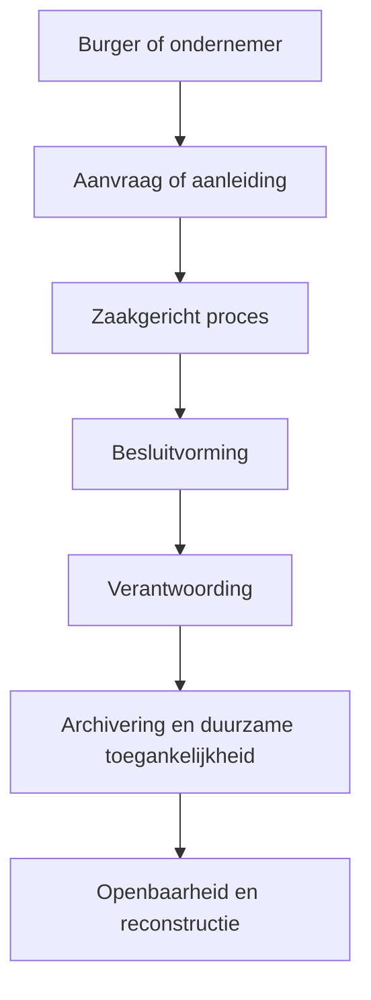

## 1.6 De rode draad van dit handboek

Dit handboek volgt de **Gouden Cirkel** van Simon Sinek:

- **Waarom** — waarom zaakgericht werken nodig is
- **Hoe** — hoe dit wordt ingericht met kaders, architectuur en standaarden
- **Wat** — welke producten, platformen en koppelingen dat mogelijk maken

Door het hele handboek loopt één herkenbare casus mee:

**de horeca-exploitatievergunning**

Deze casus is bewust gekozen omdat zij voor veel overheidsmedewerkers herkenbaar is en goed laat zien wat het verschil is tussen:

- een **zaak**: het proces van aanvraag tot besluit,
- een **object**: bijvoorbeeld de vergunning, het pand of de ondernemer,
- een **registratie**: de administratieve vastlegging van gegevens,
- en een **dossier**: de samenhangende bundel van informatie.

## 1.7 Wat medewerkers uit dit handboek moeten meenemen

Na het lezen van dit handboek moet iedere ilionx-medewerker in elk geval kunnen uitleggen:

- waarom zaakgericht werken bestuurlijk relevant is;
- hoe wet- en regelgeving doorwerkt in informatievoorziening;
- waarom informatiehuishouding niet hetzelfde is als opslag;
- wat het verschil is tussen zaak, object, registratie en dossier;
- waarom metadata, audit trails en archivering vanaf het begin belangrijk zijn;
- en hoe technologie in de overheid alleen waardevol is als zij uitlegbaar, controleerbaar en duurzaam is ingericht.

## 1.8 Samenvatting

> **Hoofdstuksamenvatting**  
> Zaakgericht werken is een manier om burgers en bedrijven beter, voorspelbaarder en rechtmatiger te bedienen. Het verbindt proces, besluitvorming, informatie en verantwoording. Voor ilionx-medewerkers is dit essentieel, omdat ilionx opereert op het snijvlak van publieke opgaven, informatiehuishouding en technologie. De burger centraal zetten betekent daarom niet alleen digitaliseren, maar vooral zorgen dat overheidsoptreden navolgbaar, betrouwbaar en duurzaam toegankelijk is.

---

# 2. Waarom: vertrouwen, transparantie en rechtmatigheid

> **Kernboodschap**  
> Vertrouwen in de overheid ontstaat niet alleen door snelheid of gebruiksgemak, maar vooral door navolgbaar, zorgvuldig en rechtmatig handelen.

## 2.1 De burger als uitgangspunt

De overheid werkt niet voor systemen, maar voor mensen. Burgers en bedrijven verwachten dat de overheid:

- duidelijk is over procedures,
- voorspelbaar handelt,
- zorgvuldig omgaat met gegevens,
- besluiten kan uitleggen,
- stukken kan terugvinden,
- fouten kan herstellen,
- en informatie toegankelijk houdt.

Zaakgericht werken ondersteunt dit doordat een overheidsorganisatie per zaak inzichtelijk maakt:

- wat de aanleiding is,
- wie betrokken zijn,
- welke stappen zijn gezet,
- welke documenten en gegevens zijn gebruikt,
- welke termijnen gelden,
- welk besluit is genomen,
- welke rechtsgevolgen dat besluit heeft,
- en hoe het dossier duurzaam wordt bewaard.

## 2.2 Vertrouwen ontstaat door navolgbaarheid

Vertrouwen ontstaat niet alleen door snelheid of vriendelijke communicatie. Het ontstaat vooral door **navolgbaarheid**. Een burger moet achteraf kunnen begrijpen:

- wanneer zijn aanvraag is ontvangen,
- op basis van welke regelgeving deze is beoordeeld,
- welke aanvullende stukken zijn gevraagd,
- wie het besluit heeft genomen,
- en welke rechtsmiddelen openstaan.

Bij de casus van de horeca-exploitatievergunning betekent dat bijvoorbeeld:

- de ondernemer vraagt een vergunning aan;
- de gemeente registreert ontvangst;
- intern worden adviezen ingewonnen;
- er vindt een Bibob-, APV- of openbare orde-beoordeling plaats;
- een besluit wordt genomen;
- het besluit wordt bekendgemaakt;
- het zaakdossier wordt gearchiveerd;
- de verleende vergunning blijft als object of recht beheerd.

## 2.3 Transparantie is een kerntaak

Transparantie is geen extra functionaliteit, maar een kernverplichting. De **Wet open overheid (Woo)** verplicht bestuursorganen tot zowel passieve als actieve openbaarmaking.

Officiële bron:

- [Wet open overheid](https://wetten.overheid.nl/BWBR0045754/)

Zaakgericht werken helpt hierbij door informatie beter vindbaar, classificeerbaar en reproduceerbaar te maken. Zonder goede zaakstructuur wordt Woo-afhandeling traag, risicovol en kostbaar.

## 2.4 Rechtmatigheid vraagt om informatie op orde

Besluiten van de overheid hebben rechtsgevolgen. Dat betekent dat het besluitvormingsproces toetsbaar moet zijn aan onder meer:

- bevoegdheid,
- zorgvuldigheid,
- motivering,
- kenbaarheid,
- dossiervorming,
- bewaartermijnen,
- en privacyregels.

Een systeem dat alleen “taken afvinkt” maar geen duurzame, contextuele vastlegging ondersteunt, schiet tekort.

## 2.5 Vertrouwen, informatie en rechtsstaat

Zaakgericht werken moet daarom niet worden gezien als een optimalisatietechniek, maar als onderdeel van de manier waarop de overheid haar rechtsstatelijke verantwoordelijkheid invult.

Een burger hoeft niet te weten welk systeem een organisatie gebruikt, maar moet er wel op kunnen vertrouwen dat de overheid:

- zorgvuldig werkt,
- gegevens niet verliest,
- termijnen bewaakt,
- besluiten kan uitleggen,
- en later nog kan reconstrueren wat er is gebeurd.

Daarmee staat zaakgericht werken in directe relatie tot:

- burgervertrouwen,
- transparantie,
- rechtmatigheid,
- en bestuurlijke betrouwbaarheid.

## 2.6 Casusbeeld: horeca-exploitatievergunning

Bij een horeca-exploitatievergunning raakt dit allemaal aan elkaar. De ondernemer verwacht:

- duidelijkheid over de vergunningplicht,
- een correct ontvangstproces,
- tijdige behandeling,
- begrijpelijke communicatie,
- een gemotiveerd besluit,
- en inzicht in eventuele bezwaar- of beroepsmogelijkheden.

De gemeente moet tegelijk kunnen aantonen:

- welke aanvraag is ontvangen,
- welke regels zijn toegepast,
- welke stukken zijn gebruikt,
- wie heeft beoordeeld,
- welke adviezen zijn ingewonnen,
- welk besluit is genomen,
- en hoe dit alles later nog reconstrueerbaar is.

## 2.7 Visueel overzicht

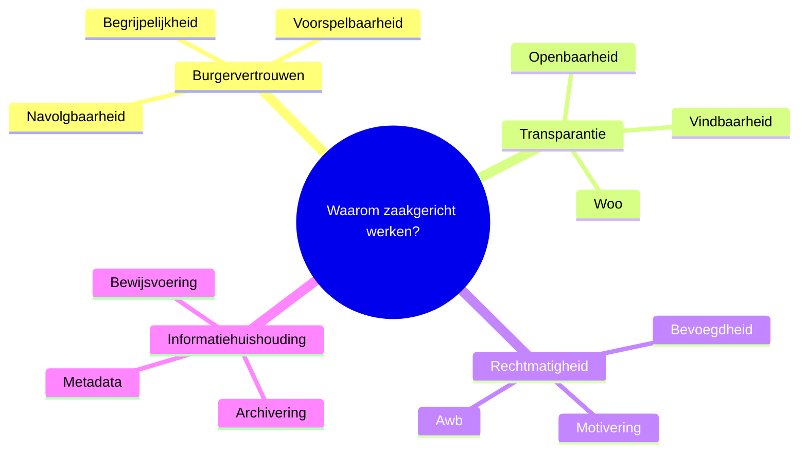

## 2.8 Samenvatting

> **Hoofdstuksamenvatting**  
> Vertrouwen in de overheid ontstaat niet alleen door snelheid of digitalisering, maar vooral door navolgbaarheid, transparantie en rechtmatigheid. Zaakgericht werken ondersteunt dit doordat het processen, documenten, termijnen, besluiten en dossieropbouw in samenhang organiseert. In de horeca-exploitatievergunningcasus wordt zichtbaar dat een burger vooral wil kunnen begrijpen wat de overheid doet, waarom zij dat doet en hoe dat later nog aantoonbaar blijft.
>
> # 3. Waarom: wet- en regelgeving als fundament

> **Kernboodschap**  
> Zaakgericht werken is geen softwarekeuze. Het is een antwoord op wetgeving, verantwoordingsplicht en de noodzaak van een integere informatiehuishouding.

## 3.1 Algemene wet bestuursrecht (Awb)

De **Algemene wet bestuursrecht (Awb)** regelt hoe bestuursorganen besluiten voorbereiden, nemen en bekendmaken.

Officiële bron:

- [Algemene wet bestuursrecht](https://wetten.overheid.nl/BWBR0005537/)

Voor zaakgericht werken zijn vooral relevant:

- ontvangstbevestiging
- beslistermijnen
- zorgvuldige voorbereiding
- hoor en wederhoor
- motiveringsplicht
- bekendmaking
- bezwaar en beroep

In de horeca-vergunningcasus is de Awb zichtbaar in vrijwel elke stap van de zaak.

## 3.2 Wet open overheid (Woo)

De **Woo** vraagt om:

- actieve openbaarmaking van informatiecategorieën,
- afhandeling van informatieverzoeken,
- betere vindbaarheid en ordening van informatie,
- transparante procesvoering.

Zaakgericht werken ondersteunt de Woo doordat dossiers, documenten, metadata en besluiten beter geordend zijn.

Officiële bron:

- [Wet open overheid](https://wetten.overheid.nl/BWBR0045754/)

## 3.3 Archiefwet en archiefregelgeving

De **Archiefwet** en onderliggende regelgeving verplichten overheidsorganisaties om archiefbescheiden in goede, geordende en toegankelijke staat te brengen en te bewaren.

Officiële bronnen:

- [Archiefwet 1995](https://wetten.overheid.nl/BWBR0007376/)
- [Nationaal Archief – DUTO](https://www.nationaalarchief.nl/archiveren/kennisbank/duurzaam-toegankelijke-overheidsinformatie-duto)

Voor zaakgericht werken betekent dit:

- metadata vanaf creatie,
- ordening op context,
- authenticiteit,
- integriteit,
- duurzame toegankelijkheid,
- selecteren en vernietigen op basis van selectielijsten,
- overbrenging naar e-depot waar nodig.

## 3.4 Selectielijsten

**Selectielijsten** bepalen welke informatie blijvend moet worden bewaard en welke na termijn vernietigd mag of moet worden.

Officiële bron:

- [Selectielijsten – Nationaal Archief](https://www.nationaalarchief.nl/archiveren/selectielijsten)

In de horeca-casus kan bijvoorbeeld gelden:

- aanvraagstukken: bewaren volgens vastgestelde termijn,
- besluit en onderliggende motivering: bewaren conform selectielijst,
- vergunninghistorie: afhankelijk van waardering en context,
- toezicht- en handhavingsinformatie: eigen bewaartermijnen.

Zaakgericht werken zonder koppeling aan selectielogica leidt vrijwel altijd tot risico’s.

## 3.5 AVG

De **Algemene verordening gegevensbescherming (AVG)** vereist onder meer:

- doelbinding,
- minimale gegevensverwerking,
- transparantie,
- bewaarbeperking,
- juistheid,
- integriteit.

Officiële bron:

- [Autoriteit Persoonsgegevens](https://www.autoriteitpersoonsgegevens.nl/)

Bij zaakgericht werken betekent dit:

- alleen noodzakelijke persoonsgegevens verwerken,
- toegang en gebruik goed begrenzen,
- bewaartermijnen toepassen,
- verwerkingen kunnen uitleggen.

## 3.6 WHO

Met **WHO** wordt in overheidscontext doorgaans verwezen naar de kaders rond **hergebruik van overheidsinformatie**, nauw verbonden met open data-verplichtingen en Europese ontwikkelingen.

Voor medewerkers is vooral relevant: informatie moet niet alleen bewaard worden, maar waar mogelijk ook herbruikbaar beschikbaar zijn.

## 3.7 MDTO

**MDTO** staat voor **Metagegevens Duurzaam Toegankelijke Overheidsinformatie**.

Officiële bron:

- [MDTO – Nationaal Archief](https://www.nationaalarchief.nl/archiveren/kennisbank/metagegevens-duurzaam-toegankelijke-overheidsinformatie-mdto)

MDTO is cruciaal omdat zonder metadata geen duurzame toegankelijkheid bestaat. Niet alleen het document, maar ook zijn context moet begrijpelijk blijven.

## 3.8 e-depots

**e-Depots** zijn voorzieningen voor de duurzame bewaring en raadpleegbaarheid van digitale archiefbescheiden.

Officiële bron:

- [e-Depot – Nationaal Archief](https://www.nationaalarchief.nl/archiveren/kennisbank/e-depot)

## 3.9 Datagedreven werken

Datagedreven werken is geen doel op zich. In de overheid moet datagedreven werken altijd:

- uitlegbaar zijn,
- toetsbaar zijn,
- proportioneel zijn,
- herleidbaar zijn,
- en verantwoord zijn.

Zaakgericht werken levert hiervoor de context waarbinnen data betekenis krijgen.

## 3.10 WMEBV

De **Wet modernisering elektronisch bestuurlijk verkeer (WMEBV)** regelt de modernisering van digitale communicatie tussen burger en bestuur.

Belang voor zaakgericht werken:

- digitale kanalen moeten juridisch houdbaar zijn,
- ontvangst en statuscommunicatie moeten kloppen,
- berichten moeten aan het juiste dossier of de juiste zaak gekoppeld worden.

## 3.11 WDO

De **Wet digitale overheid (WDO)** gaat onder meer over betrouwbaar digitaal verkeer met de overheid.

## 3.12 WCAG

**WCAG-richtlijnen** zijn bepalend voor digitale toegankelijkheid.

Officiële bron:

- [DigiToegankelijk](https://www.digitaleoverheid.nl/onderwerpen/digitoegankelijk/)

Een zaakportaal of vergunningportaal dat niet toegankelijk is, sluit burgers uit en ondermijnt rechtsgelijkheid.

## 3.13 DSA

De **Digital Services Act (DSA)** is vooral relevant waar platformfunctionaliteit, publicatie, moderatie en online dienstverlening raken aan publieke digitale omgevingen.

Officiële bron:

- [Europese Commissie – Digital Services Act](https://digital-strategy.ec.europa.eu/)

## 3.14 WPG

De **Wet politiegegevens (WPG)** is relevant zodra gegevensuitwisseling raakt aan politiedomeinen, toezicht, openbare orde of samenwerkingsstructuren met veiligheidsketens.

Officiële bron:

- [Wet politiegegevens](https://wetten.overheid.nl/BWBR0022463/)

Bij de horeca-vergunningcasus kan dit relevant zijn bij openbare-orde-informatie, Bibob-context of ketensamenwerking, afhankelijk van de wettelijke grondslag en rolverdeling.

## 3.15 Visueel overzicht: wetgeving als fundament

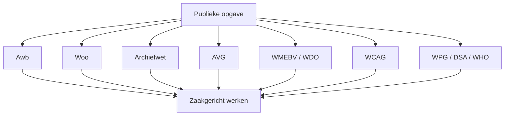

## 3.16 Samenvatting

> **Hoofdstuksamenvatting**  
> Zaakgericht werken is geworteld in wet- en regelgeving. Het is geen vrije softwarekeuze, maar een manier om Awb, Woo, Archiefwet, AVG en andere publieke kaders uitvoerbaar te maken in processen, systemen en informatiehuishouding. De kern is dat de overheid haar handelen niet alleen uitvoert, maar ook juridisch en bestuurlijk moet kunnen uitleggen, reconstrueren en duurzaam toegankelijk houden.

---

# 4. De casus als rode draad: horeca-exploitatievergunning

> **Praktijkvoorbeeld**  
> Een horeca-exploitatievergunning laat zien waarom goed onderscheid tussen proces, object, besluit en dossier essentieel is.

## 4.1 De situatie

Een ondernemer wil een café openen in een gemeentelijk pand of gehuurd pand. Hiervoor is vaak een **horeca-exploitatievergunning** nodig. Daarnaast kunnen ook andere toestemmingen nodig zijn, zoals:

- omgevingsvergunning,
- drank- en horecavergunning,
- terrasvergunning,
- evenementenvergunning,
- meldingen brandveilig gebruik,
- Bibob-onderzoek,
- inschrijving in relevante registraties.

## 4.2 Wat is in deze casus de zaak?

De **zaak** is het proces van behandeling van de vergunningaanvraag:

- aanvraag ontvangen,
- ontvankelijkheid controleren,
- aanvullende informatie opvragen,
- interne en externe adviezen opvragen,
- besluit opstellen,
- besluit nemen,
- besluit bekendmaken,
- bezwaar afhandelen indien nodig,
- zaak sluiten.

## 4.3 Wat is het object?

Het **object** is niet het proces, maar datgene waar het proces betrekking op heeft. Meerdere objecten kunnen tegelijk relevant zijn:

- het pand
- de ondernemer
- de onderneming
- de inrichting
- de vergunning als rechtstoestand
- eventueel een terras
- eventueel een locatie of vestiging

De verleende vergunning is dus geen processtap, maar een juridisch recht of rechtspositie die als object of registratie beheerd moet kunnen worden, ook ná afronding van de zaak.

## 4.4 Wat is de registratie?

Een **registratie** is de administratieve vastlegging van een gegeven, bijvoorbeeld:

- aanvraagdatum,
- zaaknummer,
- naam aanvrager,
- locatiecode,
- datum besluit,
- geldigheidsperiode,
- status vergunning.

Registraties zijn noodzakelijk, maar niet hetzelfde als de zaak zelf.

## 4.5 Wat is de case of het dossier?

Een **case / dossier** is de samenhangende bundeling van informatie die over een onderwerp, rechtsverhouding of behandelingseenheid wordt beheerd. Bij een vergunning kan een dossier bestaan uit:

- aanvraagformulier,
- bijlagen,
- correspondentie,
- adviesnota’s,
- interne beoordelingen,
- besluit,
- publicatie,
- bezwaarstukken,
- handhavingsinformatie,
- historische mutaties.

Een dossier kan één zaak omvatten, maar ook meerdere zaken of een langere levenscyclus rond hetzelfde object of recht.

## 4.6 Waarom deze casus zo geschikt is

De horeca-exploitatievergunning is een goede leer-casus omdat zij tegelijk raakt aan:

- besluitvorming,
- vergunningverlening,
- objectbeheer,
- publicatie,
- archivering,
- Woo,
- toezicht,
- openbare orde,
- en soms ketensamenwerking.

Daarom laat deze casus goed zien waarom een overheid onderscheid moet maken tussen proces, object, registratie en dossier.

## 4.7 Visueel overzicht: zaak, object, registratie en dossier

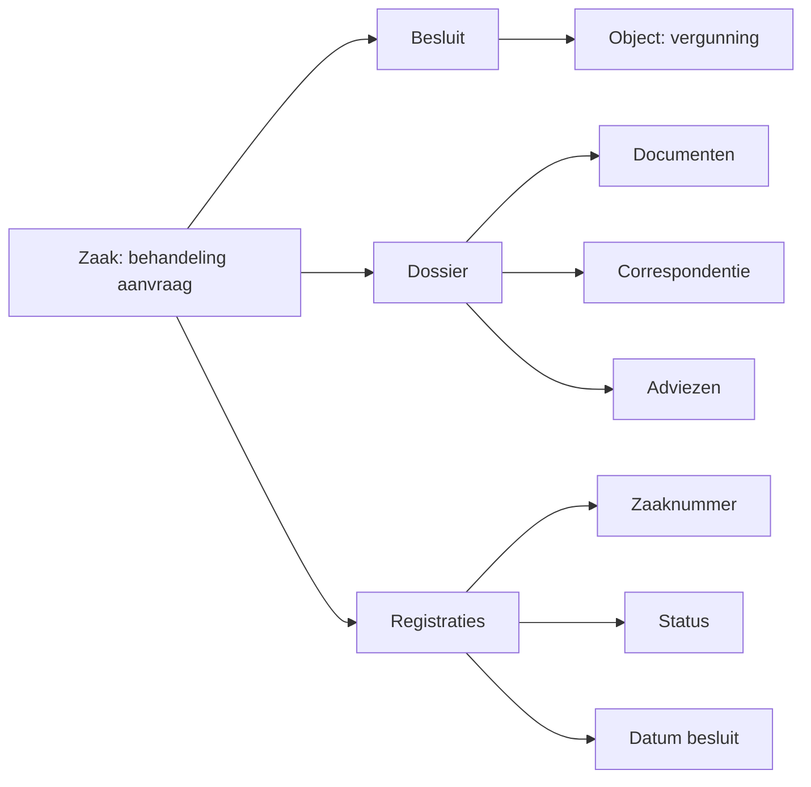

## 4.8 Samenvatting

> **Hoofdstuksamenvatting**  
> In de casus van de horeca-exploitatievergunning is de zaak het proces van behandeling, het object de vergunning of een ander betrokken rechts- of informatieobject, de registratie de administratieve vastlegging van gegevens en het dossier de bundel samenhangende informatie. Juist deze casus maakt zichtbaar waarom scherp onderscheid tussen die begrippen nodig is voor dienstverlening, archivering, openbaarheid en bestuurlijke betrouwbaarheid.
>
> # 5. Zaak, registratie, object en case: scherpe definities

> **Waarschuwingspunt**  
> Veel problemen in overheidslandschappen ontstaan doordat registratie, zaak, dossier en object door elkaar worden gehaald.

## 5.1 Registratie

Een **registratie** is een vastgelegd gegeven in een administratie of voorziening. Voorbeelden:

- een inschrijving
- een statusveld
- een ontvangstdatum
- een kenmerk
- een koppeling naar een persoon of adres

Een registratie geeft structuur, maar beschrijft niet automatisch context of proces.

## 5.2 Zaak

Een **zaak** is een samenhangende hoeveelheid werk met een duidelijke aanleiding, resultaatverplichting, statusverloop en uitkomst. Een zaak heeft doorgaans:

- een startmoment
- een aanleiding
- een behandeldoel
- betrokkenen
- termijnen
- activiteiten
- documenten
- een eindresultaat

De zaak is dus het **procesmatige spoor**.

## 5.3 Object

Een **object** is datgene waar informatie over wordt beheerd of waarop rechten, toestanden of kenmerken betrekking hebben. Voorbeelden:

- persoon
- adres
- pand
- vergunning
- onderneming
- locatie
- besluittype
- toezichtobject

Het object is dus het **inhoudelijke of juridische spoor**.

## 5.4 Case / Dossier

Een **case** of **dossier** is een bundel samenhangende informatie die gedurende langere tijd wordt beheerd rondom een onderwerp, rechtsverhouding, cliënt, vergunning, gebied of gebeurtenis.

Een dossier kan:

- meerdere zaken bevatten,
- meerdere objecten verbinden,
- of juist een integrale kijk geven die in een zuiver zaakmodel ontbreekt.

## 5.5 Waarom ongestructureerd casemanagement riskant is

Ongestructureerd casemanagement klinkt vaak aantrekkelijk: “we willen flexibiliteit”. Maar zonder heldere informatiestructuur ontstaan snel problemen:

- besluiten zijn slecht reconstrueerbaar,
- metadata ontbreken,
- bewaartermijnen worden niet correct toegepast,
- Woo-verzoeken zijn moeilijk af te handelen,
- zaakstatus is onduidelijk,
- objecthistorie raakt versnipperd,
- auditability ontbreekt,
- en processen worden persoonsafhankelijk.

## 5.6 Typische valkuilen

| Valkuil | Gevolg |
|---|---|
| Alles in één “dossierbak” stoppen | Geen onderscheid tussen proces, object en bewijslast |
| Takenlijst als dossier gebruiken | Geen duurzame context |
| Documentopslag zonder metadata | Slechte vindbaarheid en archivering |
| Zaaksysteem gebruiken als objectregister | Verlies van juridische levenscyclus |
| M365-mapstructuur als primaire IHH | Onvoldoende sturing op bewaartermijnen en context |

## 5.7 Casusverdieping: horeca-exploitatievergunning

In de horeca-casus wordt het verschil scherp zichtbaar:

- de **aanvraagbehandeling** is de zaak,
- de **verleende vergunning** is een object of rechtstoestand,
- het **zaaknummer** is een registratie,
- het **vergunningdossier** is de bundel van samenhangende informatie.

Wie deze lagen vermengt, krijgt vroeg of laat problemen met:

- bezwaar en beroep,
- Woo,
- archivering,
- objecthistorie,
- of vervolgprocessen zoals verlenging, wijziging of intrekking.

## 5.8 Visueel onderscheid

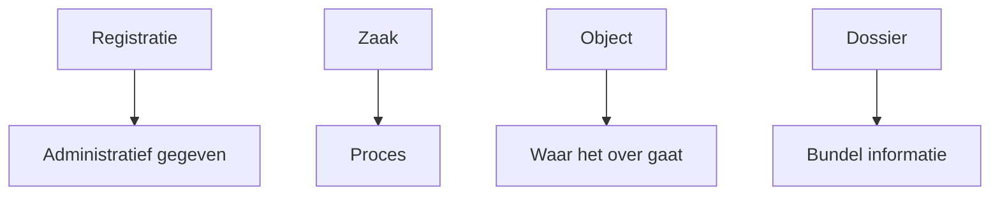

## 5.9 Samenvatting

> **Hoofdstuksamenvatting**  
> Het onderscheid tussen registratie, zaak, object en dossier is fundamenteel voor volwassen zaakgericht werken. Zonder dat onderscheid ontstaan systemen die wel informatie opslaan, maar onvoldoende context, rechtspositie, procesverloop en archiefwaarde ondersteunen. In de overheid is dat niet alleen inefficiënt, maar ook bestuurlijk risicovol.

---

# 6. Hoe: architectuurkaders voor de overheid

> **Kernboodschap**  
> Architectuur is niet een technisch plaatje achteraf, maar een bestuurlijk instrument om samenhang, uitlegbaarheid en wendbaarheid af te dwingen.

## 6.1 NORA

**NORA** is de **Nederlandse Overheid Referentie Architectuur**.

Officiële bron:

- [NORA Online](https://www.noraonline.nl/)

NORA biedt principes voor:

- dienstverlening,
- samenwerking,
- interoperabiliteit,
- informatiehuishouding,
- beveiliging,
- wendbaarheid,
- publieke waarden.

Voor zaakgericht werken zijn vooral belangrijk:

- gegevens worden eenmalig vastgelegd en meervoudig gebruikt,
- informatie is herleidbaar en betrouwbaar,
- processen zijn transparant,
- dienstverlening is kanaalonafhankelijk,
- architectuur ondersteunt publieke waarden.

## 6.2 RORA

**RORA** is de **RijksOverheid Referentie Architectuur**.

Binnen rijksorganisaties is RORA belangrijk als concretisering van overheidsarchitectuur.

## 6.3 GEMMA

**GEMMA** is de referentiearchitectuur voor gemeenten.

Officiële bron:

- [GEMMA Online](https://www.gemmaonline.nl/)

Voor gemeentelijke zaakgerichte dienstverlening is GEMMA bijzonder relevant omdat hierin:

- zaaktypen,
- objecttypen,
- API-standaarden,
- bedrijfsfuncties,
- en Common Ground-principes

praktisch worden gemaakt.

## 6.4 ADO2030

**ADO2030** verwijst naar architectuur- en ontwikkelrichtingen voor de digitale overheid richting 2030, inclusief samenhang tussen dienstverlening, data, platformen en publieke waarden. In de praktijk moet dit gelezen worden als een ontwikkelkader richting een meer open, interoperabele en duurzame overheid.

## 6.5 Waarom architectuur ertoe doet

Architectuur is niet “een plaatje voor architecten”. Het is de afspraaklaag tussen:

- bestuur,
- beleid,
- uitvoering,
- informatievoorziening,
- leveranciers,
- en ketenpartners.

Zonder architectuur krijg je lokaal geoptimaliseerde systemen die centraal onbestuurbaar worden.

## 6.6 Architectuur in relatie tot de casus

In de horeca-exploitatievergunning helpt architectuur om te bepalen:

- waar zaakafhandeling thuishoort,
- waar objectgegevens thuishoren,
- hoe documenten worden beheerd,
- hoe besluiten worden vastgelegd,
- hoe archivering wordt georganiseerd,
- en welke koppelingen nodig zijn voor interoperabiliteit.

Daarmee voorkomt architectuur dat één applicatie ongemerkt alle rollen tegelijk krijgt.

## 6.7 Visueel overzicht: architectuur als verbindende laag

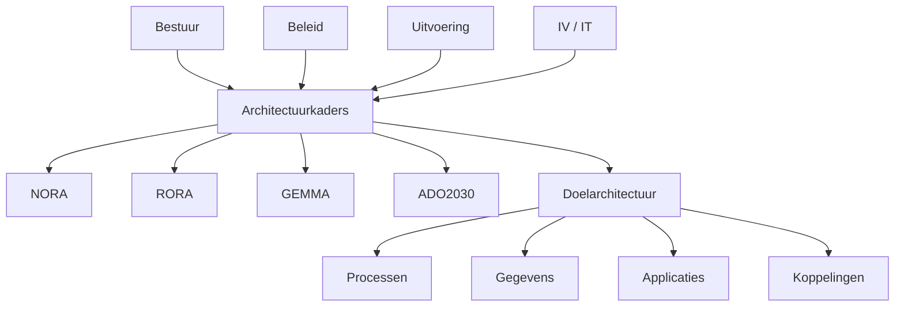

## 6.8 Samenvatting

> **Hoofdstuksamenvatting**  
> Architectuurkaders zoals NORA, RORA en GEMMA zijn geen theoretische bijzaak, maar het fundament voor bestuurlijke samenhang. Ze helpen overheidsorganisaties om proces, informatie, applicaties en verantwoordelijkheden in lijn te brengen met publieke waarden. In zaakgericht werken voorkomt goede architectuur dat lokale systeemkeuzes leiden tot structurele bestuurlijke onduidelijkheid.
>
> # 7. Hoe: standaarden voor duurzame informatiehuishouding

> **Kernboodschap**  
> Standaarden zijn geen technische details, maar bestuurlijke instrumenten om duurzaamheid, interoperabiliteit en uitlegbaarheid af te dwingen.

## 7.1 MDTO

**MDTO** beschrijft welke metadata nodig zijn om informatie duurzaam toegankelijk te houden. Denk aan metadata over:

- inhoud
- context
- structuur
- beheer
- proces
- datering
- herkomst
- authenticiteit

## 7.2 TMR

**TMR** wordt in IHH-context vaak gebruikt als verwijzing naar kaders voor toepassingsprofielen metadata rijksoverheid of soortgelijke metadatarichtlijnen. De precieze invulling kan organisatieafhankelijk zijn, maar de essentie blijft: metadata moeten niet vrijblijvend zijn.

## 7.3 DUTO

**DUTO** staat voor **Duurzaam Toegankelijke Overheidsinformatie**.

Officiële bron:

- [DUTO – Nationaal Archief](https://www.nationaalarchief.nl/archiveren/kennisbank/duurzaam-toegankelijke-overheidsinformatie-duto)

DUTO richt zich op kwaliteitscriteria voor duurzame toegankelijkheid. Niet alleen bewaren, maar ook later nog kunnen begrijpen, vertrouwen en gebruiken.

## 7.4 NEN 2084:2024

**NEN 2084:2024** biedt een normatief kader voor functionaliteit in informatiesystemen en informatiebeheer, met sterke relevantie voor zaakgericht werken, dossiervorming en archivering.

De norm helpt bij vragen als:

- welke informatie moet wanneer worden vastgelegd?
- hoe wordt context behouden?
- welke bewijskracht is nodig?
- hoe voorkom je verlies van samenhang?

## 7.5 Waarom standaarden ertoe doen

Standaarden zijn in de overheid van belang omdat zij helpen om:

- overdraagbaarheid te vergroten,
- leveranciersafhankelijkheid te beperken,
- metadata structureel toe te passen,
- informatie later nog te kunnen interpreteren,
- en processen consistent in te richten.

Zonder standaarden verandert digitalisering al snel in lokale variatie zonder duurzame samenhang.

## 7.6 Relatie met de horeca-casus

In de horeca-exploitatievergunning betekenen standaarden concreet dat:

- metadata vanaf ontvangst worden meegegeven,
- zaak, document en objectrelaties expliciet zijn,
- bewaartermijnen zijn gekoppeld aan zaaktype of dossierprofiel,
- documenten later nog in context kunnen worden begrepen,
- en een overbrenging naar e-depot niet opnieuw handmatig hoeft te worden uitgevonden.

## 7.7 Visueel overzicht: standaarden in samenhang

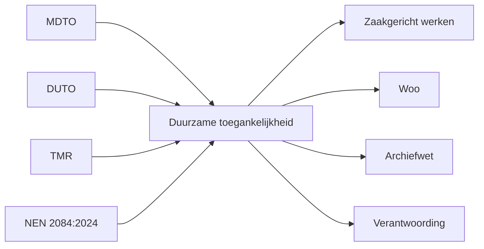

## 7.8 Samenvatting

> **Hoofdstuksamenvatting**  
> Standaarden zoals MDTO, DUTO, TMR en NEN 2084:2024 zijn essentieel voor duurzame informatiehuishouding. Ze zorgen ervoor dat informatie niet alleen vandaag bruikbaar is, maar ook later nog vindbaar, interpreteerbaar, controleerbaar en overdraagbaar blijft. Voor zaakgericht werken zijn zij daarom bestuurlijk net zo relevant als technisch.

---

# 8. NEN 2084:2024 volledig uitgewerkt

> **Taxonomie-overzicht**  
> De vijf hoofdgroepen van NEN 2084:2024 helpen om informatie niet alleen op te slaan, maar doelgericht bestuurbaar te maken.

Hieronder staat een uitgewerkte taxonomie in tabelvorm met de vijf verplichte hoofdgroepen.

## 8.1 Overzicht hoofdgroepen

| Hoofdgroep | Doel | Kernvraag |
|---|---|---|
| Planning | Sturen op voortgang, termijnen en acties | Wat moet wanneer gebeuren? |
| Regeling | Vastleggen van kaders, regels, besluiten en bevoegdheden | Op basis waarvan handelen we? |
| Berichtgeving | Vastleggen van communicatie en uitwisseling | Wie heeft wat aan wie gemeld? |
| Vastlegging | Registreren van feiten, context en inhoud | Wat is gebeurd en hoe is dat vastgelegd? |
| Bewijs | Aantonen van authenticiteit, integriteit en rechtsgeldigheid | Kunnen we het achteraf bewijzen? |

## 8.2 Planning

| Onderdeel | Toelichting | Voorbeeld in horeca-casus | Bestuurlijke betekenis |
|---|---|---|---|
| Termijnbewaking | Bewaken wettelijke en interne termijnen | Beslistermijn vergunning | Voorkomt termijnoverschrijding en rechtsgevolgen |
| Activiteitenplanning | Stappen, taken en afhankelijkheden | Advies opvragen bij toezicht | Maakt uitvoering bestuurbaar |
| Escalatie | Signaleren overschrijdingen | Overschrijding behandeltermijn | Ondersteunt verantwoording en bijsturing |
| Statusverloop | Van intake tot afronding | Ontvangen, in behandeling, besloten | Maakt proces navolgbaar |
| Capaciteitssturing | Werkvoorraad en prioritering | Piek in seizoensaanvragen | Ondersteunt management en planning |

## 8.3 Regeling

| Onderdeel | Toelichting | Voorbeeld in horeca-casus | Bestuurlijke betekenis |
|---|---|---|---|
| Juridische grondslag | Wettelijke basis van handeling | APV, Awb, lokale verordening | Zorgt voor rechtmatigheid |
| Bevoegdheden | Wie mag wat besluiten | Mandaat vergunningverlener | Ondersteunt geldige besluitvorming |
| Besluitregels | Voorwaarden en criteria | Openingstijden, openbare orde | Maakt afwegingen uitlegbaar |
| Beleidskaders | Lokale beleidsuitwerking | Horecabeleid centrumgebied | Verbindt bestuur en uitvoering |
| Selectie- en bewaarkaders | Hoe lang bewaren of vernietigen | Selectielijst vergunningdossiers | Verbindt informatie en archiefbeheer |

## 8.4 Berichtgeving

| Onderdeel | Toelichting | Voorbeeld in horeca-casus | Bestuurlijke betekenis |
|---|---|---|---|
| Inkomende berichten | Ontvangen communicatie | Digitale aanvraag | Startpunt van formele behandeling |
| Uitgaande berichten | Verzonden communicatie | Verzoek om aanvulling | Ondersteunt zorgvuldige behandeling |
| Bekendmaking | Formele communicatie van besluit | Beschikking aan aanvrager | Essentieel voor rechtsgevolg |
| Interne communicatie | Afstemming en behandeling | Interne adviesnotitie | Ondersteunt besluitvorming |
| Ketencommunicatie | Uitwisseling met derden | Advies veiligheidsketen | Nodig voor samenhangende uitvoering |

## 8.5 Vastlegging

| Onderdeel | Toelichting | Voorbeeld in horeca-casus | Bestuurlijke betekenis |
|---|---|---|---|
| Registratie van feiten | Basisvastlegging van gebeurtenis | Ontvangst aanvraag | Zorgt voor processtart en traceerbaarheid |
| Dossiervorming | Samenhangend geheel van informatie | Vergunningdossier | Maakt reconstructie mogelijk |
| Metadata | Context over informatie | Datum, auteur, zaaktype | Ondersteunt vindbaarheid en duurzaamheid |
| Versiebeheer | Beheersen van wijzigingen | Nieuwe versie besluitnota | Ondersteunt correcte besluitvorming |
| Relaties | Verbanden tussen zaak, object en document | Koppeling vergunning aan pand | Bewaart samenhang tussen lagen |

## 8.6 Bewijs

| Onderdeel | Toelichting | Voorbeeld in horeca-casus | Bestuurlijke betekenis |
|---|---|---|---|
| Authenticiteit | Is dit het echte, oorspronkelijke stuk? | Origineel besluitdocument | Nodig voor vertrouwen en rechtskracht |
| Integriteit | Is het ongewijzigd of wijziging traceerbaar? | Auditlog op documentmutaties | Ondersteunt controle en bewijs |
| Herleidbaarheid | Wie deed wat wanneer? | Behandelhistorie | Ondersteunt verantwoording |
| Rechtsgeldigheid | Is het besluit geldig genomen en bekendgemaakt? | Besluit met juiste mandatering | Essentieel voor bestuurlijke houdbaarheid |
| Controleerbaarheid | Kan een auditor of rechter het reconstrueren? | Volledig zaakdossier | Ondersteunt toezicht en rechtsbescherming |

## 8.7 Waarom deze taxonomie belangrijk is

De waarde van NEN 2084:2024 zit in het afdwingen van een bredere blik. Veel implementaties richten zich te eenzijdig op:

- workflow,
- documentopslag,
- of statusvelden.

Maar zonder de hoofdgroep **Bewijs** is een systeem bestuurlijk zwak. Zonder **Regeling** mist juridische context. Zonder **Vastlegging** raakt samenhang verloren.

## 8.8 Mermaid-overzicht van de vijf hoofdgroepen

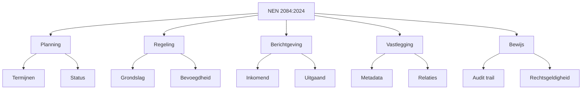

## 8.9 Samenvatting

> **Hoofdstuksamenvatting**  
> NEN 2084:2024 helpt om informatie niet alleen functioneel, maar ook bestuurlijk en juridisch goed te ordenen. De vijf hoofdgroepen — Planning, Regeling, Berichtgeving, Vastlegging en Bewijs — maken zichtbaar dat volwassen zaakgericht werken veel verder gaat dan workflow of documentopslag. Pas als ook bewijs, context en regeling zijn meegenomen, ontstaat een informatievoorziening die echt houdbaar is.
>
> # 9. Datagedreven werken en Common Ground

> **Kernboodschap**  
> Datagedreven werken is in de overheid alleen verantwoord als data, context, rechtsgrond en publieke waarden in samenhang worden beheerd.

## 9.1 Datagedreven werken in de overheid

Datagedreven werken betekent in de overheidscontext niet simpelweg “meer dashboards”. Het betekent:

- betere besluiten op basis van betrouwbare gegevens,
- verantwoorde analyse,
- zicht op prestaties en risico’s,
- ondersteuning van dienstverlening,
- en hergebruik van data binnen publieke waarden.

Datagedreven werken heeft binnen de overheid dus altijd een dubbele opgave:

1. **betere sturing en uitvoering**, en  
2. **behoud van rechtmatigheid, uitlegbaarheid en proportionaliteit**.

## 9.2 De grenzen van datagedreven werken

Datagedreven werken mag nooit leiden tot:

- contextverlies,
- onjuiste profilering,
- onverklaarbare besluiten,
- vermenging van doelen,
- oncontroleerbare keteneffecten,
- of analyses zonder bestuurlijke herleidbaarheid.

In publieke context geldt steeds de vraag:

- waar komt de data vandaan?
- in welke procescontext is zij ontstaan?
- met welk doel is zij verzameld?
- en mag zij voor dit nieuwe doel wel worden hergebruikt?

## 9.3 Zaakgericht werken als contextlaag voor data

Zaakgericht werken is belangrijk voor datagedreven werken omdat het context toevoegt. Zonder context zijn gegevens losstaande administratieve signalen. Met context krijgen zij betekenis.

Bijvoorbeeld in de horeca-exploitatievergunning:

- een **datum ontvangst** is slechts een registratie,
- maar in de context van een **zaak** wordt dit relevant voor termijnbewaking,
- in de context van een **besluit** wordt dit relevant voor rechtmatigheid,
- en in de context van een **dossier** wordt dit relevant voor reconstructie en Woo.

Zaakgericht werken helpt dus om data te verbinden aan:

- aanleiding,
- processtap,
- verantwoordelijke actor,
- rechtsgrond,
- besluitmoment,
- en object.

## 9.4 Common Ground

**Common Ground** is een richtinggevend principe in het gemeentelijk domein: **data bij de bron**, functies ontkoppelen, componenten uitwisselbaar maken en interoperabiliteit vergroten.

Officiële bron:

- [Common Ground via GEMMA](https://www.gemmaonline.nl/)

Belangrijke principes zijn:

- scheid proces, gegevens en interactie,
- gebruik API’s in plaats van directe databaskoppelingen,
- voorkom duplicatie,
- beheer gegevens waar ze thuishoren,
- maak uitwisseling standaardiseerbaar,
- en vermijd nieuwe monolieten.

## 9.5 Waarom Common Ground relevant is

Common Ground is niet alleen een technische richting, maar ook een bestuurlijke ontwerpkeuze. Zij ondersteunt:

- bronverantwoordelijkheid,
- transparantie,
- vervangbaarheid van componenten,
- betere samenwerking tussen organisaties,
- en betere grip op informatiehuishouding.

Zonder zulke principes ontstaat snel een landschap waarin meerdere systemen dezelfde gegevens kopiëren, bewerken en anders interpreteren. Dat vergroot de kans op fouten, onduidelijkheid en lock-in.

## 9.6 Zaakgericht werken binnen Common Ground

Een modern zaakgericht landschap bevat idealiter:

- een zaakvoorziening,
- objectregistraties,
- documentdiensten,
- besluitregistraties,
- publicatievoorzieningen,
- analytics,
- archief- of e-depotkoppelingen,

verbonden via API’s in plaats van monolithische afhankelijkheden.

Dat betekent ook dat één systeem niet ongemerkt tegelijk hoeft te zijn:

- procesmotor,
- documentopslag,
- objectregister,
- publicatieplatform,
- én archief.

## 9.7 Casusvoorbeeld: horeca-exploitatievergunning

Bij de horeca-exploitatievergunning kan een modern landschap er als volgt uitzien:

- de zaakvoorziening beheert de behandeling;
- het object “vergunning” leeft in een vergunningenregister of objectlaag;
- het pand komt uit een bronregistratie;
- de ondernemer komt uit authentieke of brongebonden registers;
- publicatie vindt plaats via een aparte voorziening;
- archivering wordt via een beheerde archiefroute geregeld;
- managementinformatie wordt afgeleid zonder de primaire registratie te vervuilen.

Dit voorkomt dat het zaaksysteem verandert in een alles-etende centrale bak.

## 9.8 Datagedreven werken zonder context: risico’s

Een belangrijke verbeterles ten opzichte van veel implementaties is dat datagedreven werken zonder zaak- en dossiercontext kan leiden tot verkeerde sturing. Dan ontstaan bijvoorbeeld:

- dashboards zonder juridische nuance,
- verkeerde vergelijkingen tussen dossiers,
- onduidelijkheid over beslisgrondslagen,
- verlies van relatie tussen object en proces,
- analyses op datasets zonder inzicht in herkomst en betekenis.

> **Waarschuwingspunt**  
> Dashboarding is geen vervanging van dossierkennis, procescontext en juridische herleidbaarheid.

## 9.9 Common Ground en ilionx

Voor ilionx is Common Ground niet alleen een gemeentelijk buzzword, maar een ontwerpprincipe dat helpt bij:

- het scheiden van verantwoordelijkheden,
- het ontwerpen van API-gedreven landschappen,
- het voorkomen van nieuwe monolieten,
- het ontsluiten van legacy op een gecontroleerde manier,
- en het positioneren van platformen zoals OneGov, IBM- of Microsoft-componenten in een bredere doelarchitectuur.

## 9.10 Visueel overzicht: Common Ground-principe

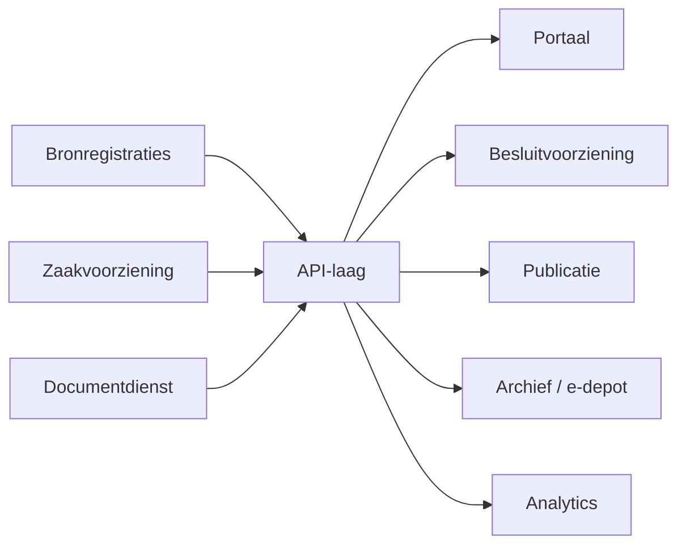

## 9.11 Samenvatting

> **Hoofdstuksamenvatting**  
> Datagedreven werken is in de overheid alleen verantwoord als data in hun juiste context blijven staan. Zaakgericht werken levert die context. Common Ground helpt om proces, gegevens en interactie logisch te scheiden en via API’s samen te brengen. Voor ilionx is dit belangrijk omdat het helpt hybride landschappen open, uitlegbaar en bestuurlijk beheersbaar te houden.

---

# 10. Immutable audit trails en bewijsvoering

> **Kernboodschap**  
> Zonder betrouwbare audit trail is er geen volwaardig bewijs van handelen, en dus geen robuuste informatiehuishouding.

## 10.1 Wat is een audit trail?

Een **audit trail** legt vast:

- wie iets deed,
- wanneer,
- vanaf welke rol of bevoegdheid,
- op welk object, document of zaak,
- met welke wijziging of uitkomst.

Een audit trail gaat dus niet alleen over techniek, maar over bestuurlijk bruikbare reconstructie.

## 10.2 Waarom “immutable” belangrijk is

Een gewone log is niet genoeg. In overheidscontext moet een audit trail zoveel mogelijk **immutabel** zijn: niet ongemerkt achteraf wijzigbaar.

Dat is nodig voor:

- bezwaar en beroep,
- accountantscontrole,
- interne controle,
- Woo-reconstructie,
- archiefauthenticiteit,
- incidentonderzoek,
- bestuursrechtelijke verantwoording.

Een audit trail die alleen door een beheerder kan worden aangepast zonder zichtbare sporen is als bewijsinstrument beperkt bruikbaar.

## 10.3 Wat minimaal moet worden vastgelegd

| Categorie | Vast te leggen |
|---|---|
| Actor | Gebruiker, systeem of ketenpartner |
| Tijd | Datum/tijd van handeling |
| Context | Zaak, dossier, object, document |
| Actie | Aanmaken, wijzigen, verzenden, besluiten |
| Resultaat | Nieuwe status, besluit, fout, afwijzing |
| Herkomst | Bron, kanaal of API-call |
| Autorisatiecontext | Rol, mandaat of bevoegdheid |

## 10.4 Praktische ontwerpprincipes

Een volwassen audit trail voldoet idealiter aan deze principes:

- audit trails los van functionele data waar mogelijk,
- niet overschrijfbaar zonder zichtbare sporen,
- relatie met zaak, document en object expliciet,
- exporteerbaar voor controle en overbrenging,
- begrijpelijk voor auditor én behandelaar,
- niet alleen technisch, maar ook functioneel leesbaar,
- geen black-box logging.

## 10.5 Casusvoorbeeld: horeca-exploitatievergunning

Bij de horeca-vergunning moet achteraf aantoonbaar zijn:

- wanneer de aanvraag is ingediend,
- wanneer aanvullende stukken zijn ontvangen,
- wie advies heeft toegevoegd,
- wanneer concept en definitief besluit zijn aangemaakt,
- wie het besluit heeft vastgesteld,
- wanneer het is verzonden of bekendgemaakt,
- welke versie rechtsgeldig was.

Als dat niet aantoonbaar is, wordt het dossier bestuurlijk kwetsbaar.

## 10.6 Relatie met bewijsvoering

Audit trails zijn geen doel op zich. Zij ondersteunen bewijsvoering. Dat betekent dat zij moeten bijdragen aan het kunnen beantwoorden van vragen als:

- wat gebeurde er precies?
- wie deed dat?
- op welk moment?
- onder welk mandaat?
- met welk resultaat?
- en is het proces achteraf controleerbaar?

Zonder deze mogelijkheid wordt het moeilijk om:

- een besluit te verdedigen,
- een Woo-verzoek af te handelen,
- een bezwaar te behandelen,
- of informatie betrouwbaar over te brengen naar een archiefvoorziening.

## 10.7 Audit trails in verschillende lagen

In een volwassen landschap spelen audit trails op meerdere niveaus:

- **procesniveau** — statusovergangen, toewijzingen, besluitmomenten,
- **documentniveau** — versiebeheer, mutaties, raadpleging,
- **objectniveau** — wijziging van vergunningstatus of rechtspositie,
- **integratieniveau** — API-calls, notificaties, ketenuitwisseling,
- **beheer- en autorisatieniveau** — roltoekenning, toegangsveranderingen.

## 10.8 Uitlegbaarheid voor niet-techneuten

Een veelgemaakte fout is dat audit trails technisch volledig zijn, maar functioneel onbruikbaar voor juristen, behandelaars of archivarissen.

Een logregel als:

`PUT /api/v1/document/3489 status=200 actor=svc_app_23`

kan technisch correct zijn, maar zegt bestuurlijk weinig zonder context.

Daarom moeten audit trails zo worden ontworpen dat ook zichtbaar is:

- welke zaak of welk dossier dit raakte,
- welk document dit betrof,
- of het om een concept of definitieve versie ging,
- en wat de betekenis van die wijziging was.

> **Kerninzicht**  
> Een audit trail is pas bestuurlijk bruikbaar als deze niet alleen technisch volledig is, maar ook functioneel uitlegbaar.

## 10.9 Relatie met archivering en Woo

Audit trails raken direct aan:

- **Archiefwet** — omdat authenticiteit en integriteit aantoonbaar moeten blijven,
- **Woo** — omdat reconstructie van behandeling en besluitvorming nodig kan zijn,
- **Awb** — omdat rechtmatigheid en motivering toetsbaar moeten zijn,
- **MDTO** — omdat contextmetadata essentieel zijn.

## 10.10 Visueel overzicht: audit trail in context

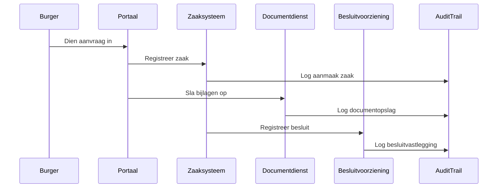

## 10.11 Samenvatting

> **Hoofdstuksamenvatting**  
> Immutable audit trails zijn onmisbaar voor publieke bewijsvoering. Zij maken zichtbaar wie wat wanneer deed, in welke context en met welk resultaat. Zonder zulke audit trails is een overheidsdossier zwak op het gebied van bezwaar, Woo, verantwoording, archivering en rechtmatigheid. De kern is dat logging niet alleen technisch moet kloppen, maar ook functioneel uitlegbaar moet zijn.
>
> # 11. Wat: softwarelandschap voor zaakgericht werken

> **Kernboodschap**  
> Het softwarelandschap is middel, geen vertrekpunt. Zaakgericht werken begint niet met een productkeuze, maar met een publieke opgave.

## 11.1 Het softwarelandschap is middel, geen vertrekpunt

Zaakgericht werken begint niet met de vraag:

**“welk systeem kopen we?”**

maar met vragen als:

- welk bestuurskundig probleem lossen we op?
- welk proces en welk besluit horen hierbij?
- welke informatie moet duurzaam toegankelijk blijven?
- welk object blijft bestaan na afsluiting van de zaak?
- welke bewijslast is vereist?

Daarna volgt pas de softwarekeuze.

## 11.2 Typische bouwblokken

| Bouwblok | Functie |
|---|---|
| Zaaksysteem | Processturing en zaakregistratie |
| DMS / ECM | Documentbeheer en dossieropbouw |
| Objectregistratie | Beheer van objecten en rechten |
| Besluitvoorziening | Vastleggen en publiceren besluiten |
| Integratielaag | API’s, events, orkestratie |
| Portaal | Interactie met burger of bedrijf |
| Archief / e-depot-koppeling | Duurzame bewaring |
| Rapportage / BI | Analyse en sturing |

## 11.3 Voorbeelden van oplossingsrichtingen

Voorbeelden van oplossingsrichtingen in de Nederlandse overheidscontext zijn:

- Rijkszaak
- Open Zaak
- OneGov
- IBM FileNet / CP4BA
- M365-gebaseerde samenwerkings- en documentdiensten

Geen van deze oplossingen is op zichzelf voldoende voor alle IHH-vraagstukken. De kracht zit in de juiste combinatie en in een heldere architectuur.

## 11.4 Waarom systeemrollen gescheiden moeten blijven

Een belangrijk reviewpunt is dat systeemrollen expliciet gescheiden moeten blijven. Zodra één platform ongemerkt tegelijk is:

- zaaksysteem,
- objectregister,
- publicatievoorziening,
- samenwerkingsruimte,
- én archief,

ontstaat bestuurlijke onduidelijkheid.

Dat leidt vaak tot:

- onduidelijk eigenaarschap,
- verkeerde toepassing van bewaartermijnen,
- verlies van objecthistorie,
- Woo-risico’s,
- en moeilijke migraties.

## 11.5 Casusvoorbeeld: horeca-exploitatievergunning

In de horeca-casus kan een logisch landschap er als volgt uitzien:

- een portaal ontvangt de aanvraag,
- een zaakvoorziening beheert de behandeling,
- een documentdienst slaat bijlagen en formele stukken op,
- een besluitvoorziening registreert het formele besluit,
- een objectregistratie beheert de vergunning als recht,
- een publicatievoorziening ondersteunt bekendmaking,
- een archiefroutine of e-depotkoppeling borgt duurzame bewaring.

## 11.6 Softwarekeuze volgt uit ontwerp

Een volwassen softwarekeuze volgt uit:

- de aard van de organisatie,
- de mate van procescomplexiteit,
- de juridische eisen,
- de benodigde dossierkwaliteit,
- het bestaande landschap,
- de veranderstrategie,
- en de gewenste mate van interoperabiliteit.

Daarom bestaat er zelden één universeel “beste” stack voor alle overheden.

## 11.7 Visueel overzicht: logisch softwarelandschap

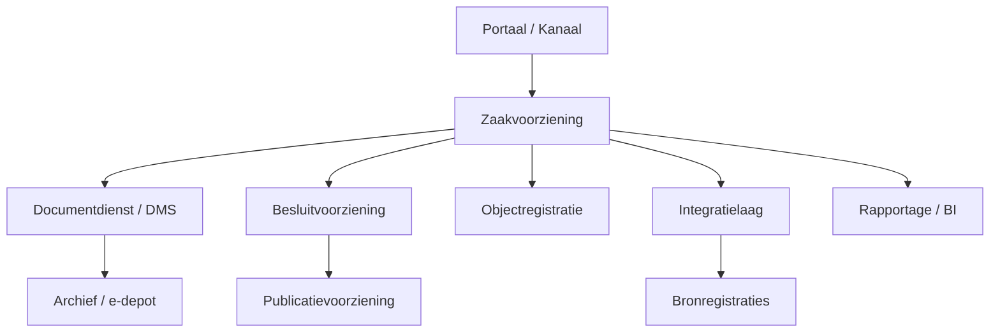

## 11.8 Samenvatting

> **Hoofdstuksamenvatting**  
> Het softwarelandschap voor zaakgericht werken bestaat uit samenwerkende bouwblokken met elk een eigen rol. Zaakgericht werken begint niet bij het product, maar bij de publieke opgave en de benodigde informatiekundige samenhang. Een goede architectuur voorkomt dat één systeem ongemerkt meerdere bestuurlijk verschillende rollen tegelijk moet dragen.

---

# 12. ZGW API’s als lijm voor interoperabiliteit

> **Kernboodschap**  
> ZGW API’s maken het mogelijk om processen, documenten, besluiten en objecten te ontkoppelen zonder samenhang te verliezen.

## 12.1 Wat zijn ZGW API’s?

**ZGW API’s** zijn API-standaarden voor zaakgericht werken, ontwikkeld om interoperabiliteit tussen componenten mogelijk te maken.

Relevante bronnen:

- [GEMMA / API-standaarden](https://www.gemmaonline.nl/)
- documentatie van Open Zaak en leveranciers in het ZGW-domein

Typische API-families zijn:

- Zaken API
- Documenten API
- Besluiten API
- Catalogi API
- Notificaties API
- Objecttypen / Objecten API-varianten in bredere Common Ground-context

## 12.2 Waarom ze belangrijk zijn

Zonder standaard-API’s ontstaat vendor lock-in. Dan wordt een zaaksysteem tegelijk:

- procesmotor,
- documentopslag,
- objectregister,
- publicatievoorziening,
- en soms pseudo-archief.

Dat is precies wat modernisering belemmert.

## 12.3 Wat ZGW API’s mogelijk maken

ZGW API’s ondersteunen:

- componentvervanging zonder totale herbouw,
- scheiding tussen bronregistraties en procesvoorzieningen,
- eenduidige metadata-uitwisseling,
- betere ketensamenwerking,
- snellere innovatie,
- aansluiting op Common Ground-principes.

## 12.4 Casusvoorbeeld: horeca-exploitatievergunning

Bij de horeca-exploitatievergunning:

- de aanvraag start een zaak via een Zaken API;
- bijlagen worden via een Documenten API opgeslagen;
- zaaktype-informatie komt uit Catalogi;
- het besluit wordt geregistreerd via een Besluiten API;
- statuswijzigingen triggeren notificaties;
- publicatie en archivering gebruiken dezelfde contextinformatie.

## 12.5 API’s lossen geen informatiefouten op

API-standaarden lossen geen informatiekundige fouten op. Als een organisatie geen onderscheid maakt tussen zaak en object, dan zet zij die verwarring gewoon via nette API’s voort.

Daarom moeten API-standaarden altijd worden gecombineerd met:

- heldere definities,
- metadata-afspraken,
- architectuurkaders,
- en governance.

## 12.6 ZGW API’s en interoperabiliteit

Interoperabiliteit betekent meer dan “systemen kunnen praten”. Het betekent ook dat:

- begrippen op elkaar aansluiten,
- metadata betekenis behouden,
- context niet verloren gaat,
- verantwoordelijkheden helder zijn,
- en uitwisseling herhaalbaar en beheerbaar is.

## 12.7 ZGW API’s en ilionx

Voor ilionx zijn ZGW API’s van belang omdat zij helpen om:

- hybride landschappen te verbinden,
- bestaande platformen beter te positioneren,
- Common Ground-principes toe te passen zonder dogmatisch te worden,
- en klanten te helpen richting een meer open en vervangbare doelarchitectuur.

## 12.8 Mermaid-overzicht: ZGW API’s in samenhang

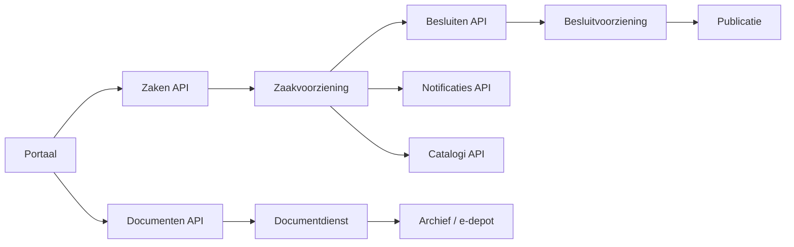

## 12.9 Samenvatting

> **Hoofdstuksamenvatting**  
> ZGW API’s zijn de lijm van een modern, modulair zaakgericht landschap. Ze helpen componenten te ontkoppelen zonder samenhang te verliezen. Maar API’s zijn alleen effectief als ook de onderliggende informatiekundige begrippen, metadata en systeemrollen kloppen. Anders wordt verwarring slechts technisch netjes verpakt.
>
> # 13. IBM-stack: FileNet en CP4BA

> **Kernboodschap**  
> De IBM-stack blijft binnen de Nederlandse overheid relevant voor organisaties met hoge eisen aan schaal, procescomplexiteit, compliance, dossieropbouw en legacy-integratie.

## 13.1 Waarom de IBM-stack relevant blijft

De Nederlandse overheid kent niet één type organisatie. Een kleine gemeente, een uitvoeringsorganisatie met miljoenen klantcontacten, een inspectiedienst en een zelfstandig bestuursorgaan hebben fundamenteel andere eisen aan procesondersteuning, dossieropbouw en integratie.

De IBM-stack — in het bijzonder **IBM FileNet** en **Cloud Pak for Business Automation (CP4BA)** — is sterk in omgevingen waar nodig is:

- grootschalig documentbeheer,
- robuuste dossiervorming,
- geavanceerde workflow en case management,
- integratie met legacy-systemen,
- strikte compliance en auditability,
- hybride modernisering in plaats van volledige greenfield-vervanging.

## 13.2 Wat is IBM FileNet?

**IBM FileNet** is een enterprise content management-platform (ECM) dat organisaties ondersteunt bij het beheren van documenten, dossiers, metadata, lifecycle en toegangsstructuren.

In overheidscontext is FileNet vooral relevant wanneer documenten niet slechts “bestanden” zijn, maar archiefwaardige informatieobjecten binnen een juridisch en procesmatig kader.

FileNet ondersteunt onder meer:

- opslag en beheer van documenten,
- classificatie en metadata,
- versiebeheer,
- dossiervorming,
- autorisatie op fijnmazig niveau,
- records management-achtige functies afhankelijk van inrichting,
- integratie met proces- en case-oplossingen.

## 13.3 Wat is CP4BA?

**IBM Cloud Pak for Business Automation (CP4BA)** is IBM’s bredere automatiseringssuite voor processen, content, decisions, workflow, capture en case management. CP4BA bouwt voort op bestaande IBM-capaciteiten en positioneert deze in een modernere, containeriseerbare en platformgerichte vorm, vaak op basis van **Red Hat OpenShift**.

CP4BA is relevant voor de overheid omdat het meerdere disciplines samenbrengt:

- procesautomatisering,
- content management,
- case management,
- business rules en decisioning,
- documentverwerking,
- workflow-orkestratie,
- integratie met API- en eventgedreven architecturen.

## 13.4 Case management is niet automatisch zaakgericht werken

Een belangrijk aandachtspunt is dat enterprise case management niet automatisch hetzelfde is als zaakgericht werken in Nederlandse overheidscontext.

Zaakgericht werken vraagt expliciet aandacht voor:

- aanleiding,
- wettelijke grondslag,
- behandeldoel,
- termijnen,
- statussen,
- resultaat,
- relatie met besluiten,
- relatie met objecten,
- archivering,
- selectielogica,
- duurzame toegankelijkheid.

Een generiek case management-platform kan uitstekend werk verdelen en informatie bundelen, maar als de inrichting onvoldoende rekening houdt met Nederlandse publieke kaders, ontstaat een systeem dat wel “cases” ondersteunt maar geen volwassen zaakgerichte informatiehuishouding.

> **Waarschuwingspunt**  
> Niet ieder case management-systeem is automatisch geschikt als zaaksysteem.

## 13.5 Toepassing in de casus: horeca-exploitatievergunning

De IBM-stack kan in deze casus op meerdere manieren worden ingezet.

### Scenario A: FileNet als document- en dossierfundament

De organisatie gebruikt een aparte proces- of zaaklaag voor de behandeling, terwijl FileNet dient als robuuste content store voor:

- aanvraagdocumenten,
- identiteits- en ondernemingsstukken,
- adviesdocumenten,
- conceptbesluiten,
- definitieve besluiten,
- correspondentie,
- bezwaarstukken,
- historische versies.

### Scenario B: CP4BA als proces- en caseplatform

De organisatie richt CP4BA in voor:

- intake van de aanvraag,
- routering van taken,
- opvragen van adviezen,
- behandelen van uitzonderingen,
- besluitvorming,
- dossiervorming,
- monitoring van doorlooptijden.

### Scenario C: Hybride landschap

Een realistischer scenario is vaak een hybride model waarin:

- brongegevens uit registers komen,
- intake via portalen verloopt,
- processturing deels in CP4BA plaatsvindt,
- dossieropbouw in FileNet plaatsvindt,
- besluiten via aparte voorzieningen worden geregistreerd of gepubliceerd,
- archiefselectie en overbrenging via gespecialiseerde voorzieningen plaatsvinden.

## 13.6 Sterke punten van de IBM-stack

| Sterkte | Betekenis voor de overheid |
|---|---|
| Schaalbaarheid | Geschikt voor grote volumes documenten, dossiers en transacties |
| Robuuste workflow | Ondersteunt complexe procespaden, uitzonderingen en escalaties |
| Integratiekracht | Sluit aan op bestaande enterprise- en legacy-landschappen |
| Auditability | Geschikt voor gedetailleerde logging, controle en reconstructie |
| Platformbenadering | Past in hybride en containergebaseerde modernisering |
| Content governance | Sterk in beheer van documenten, versies en dossiercontext |
| Flexibele case-afhandeling | Ondersteunt ook minder lineaire processen en kenniswerk |

## 13.7 Zwakke punten en risico’s

| Risico | Toelichting |
|---|---|
| Complexiteit | De inrichting vraagt specialistische kennis en stevig architectuurbeheer |
| Overmodellering | Er bestaat risico op een te zwaar of te technisch ingericht landschap |
| Vendor-afhankelijkheid | Zonder open integratieprincipes kan lock-in ontstaan |
| Gebruikerservaring | Niet altijd optimaal voor alle typen eindgebruikers |
| Verwar case met zaak | Een generiek case-model voldoet niet automatisch aan publieke zaakvereisten |
| Archiefmisvattingen | ECM-opslag alleen is nog geen volledige duurzame archivering |
| Metadata-schuld | Slechte modellering aan de voorkant leidt later tot Woo- en archiefproblemen |

## 13.8 Relatie met MDTO, DUTO en Archiefwet

Ook binnen FileNet of CP4BA moeten expliciet worden ingericht:

- metagegevens conform MDTO,
- kwaliteitscriteria conform DUTO,
- selectielogica op basis van geldende selectielijsten,
- dossiervorming in context van de Archiefwet,
- exporteerbaarheid of overbrengbaarheid naar een e-depot,
- borging van authenticiteit, integriteit en herleidbaarheid.

Technologie maakt dit mogelijk, maar garandeert het niet.

## 13.9 Immutable audit trails binnen IBM-landschappen

Een volwassen audit trail in een FileNet/CP4BA-landschap bevat ten minste:

- aanmaak, wijziging en verwijdering van informatieobjecten,
- statusovergangen in workflow of case,
- taaktoewijzingen en besluiten,
- versiegeschiedenis van documenten,
- raadplegingen waar juridisch of organisatorisch relevant,
- koppelingen met externe systemen,
- autorisatiecontext en roltoekenning,
- technische en functionele foutmeldingen met context.

## 13.10 IBM en Common Ground

Op het eerste gezicht lijken de IBM-stack en Common Ground in verschillende werelden te zitten. Toch hoeft dit geen tegenstelling te zijn.

Een IBM-landschap kan prima aansluiten op Common Ground-principes wanneer:

- functies logisch worden gescheiden,
- objectgegevens niet onnodig worden gedupliceerd,
- koppelingen via API’s verlopen in plaats van point-to-point,
- proces, content en objectregistratie expliciet worden onderscheiden,
- export en migratie niet worden geblokkeerd door proprietaire keuzes.

## 13.11 IBM-stack en ZGW API’s

Ook wanneer een organisatie een IBM-fundament gebruikt, groeit de behoefte om aan te sluiten op bredere standaarden zoals:

- Zaken API,
- Documenten API,
- Besluiten API,
- Catalogi API,
- Notificaties API.

Dat kan:

- als primaire integratiestandaard aan de buitenzijde van het platform,
- als adapterlaag tussen IBM-componenten en gemeentelijke of rijksbrede voorzieningen,
- als migratiepad van legacy ECM/case-oplossingen naar een meer ontkoppelde doelarchitectuur.

## 13.12 Rol van ilionx bij IBM-vraagstukken

Voor ilionx is de IBM-stack geen geïsoleerd technologieonderwerp, maar een strategisch instrument in moderniseringsvraagstukken binnen de overheid.

Toegevoegde waarde ligt onder meer in:

- het verbinden van business, informatiekunde en technologie;
- het expliciteren van onderscheid tussen zaak, object, registratie en dossier;
- het vertalen van Archiefwet, Woo, AVG en MDTO naar concrete systeemeisen;
- het ontsluiten van legacy zonder verlies van bestuurlijke controle;
- het ontwerpen van hybride architecturen op basis van Red Hat OpenShift;
- het inrichten van integratie met moderne API-landschappen;
- het begeleiden van migratie, rationalisatie en adoptie.

## 13.13 Mermaid-overzicht: IBM in hybride architectuur

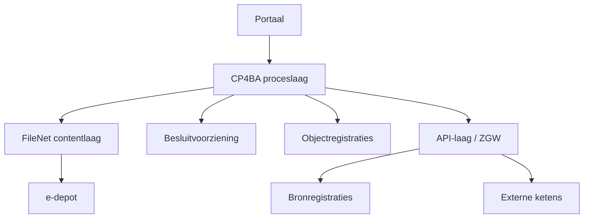

## 13.14 Samenvatting

> **Hoofdstuksamenvatting**  
> De IBM-stack met FileNet en CP4BA is vooral relevant voor organisaties met hoge eisen aan schaal, dossieropbouw, compliance, procescomplexiteit en legacy-integratie. Deze stack kan zeer krachtig zijn voor zaakgericht en dossiergericht werken, maar alleen als zij bewust wordt ingericht conform Nederlandse publieke kaders zoals Woo, Archiefwet, selectielijsten, MDTO en DUTO.
>
> # 14. Microsoft-stack: M365 in de overheidscontext

> **Kernboodschap**  
> Microsoft 365 is in de overheid onmisbaar als samenwerkings- en productiviteitsplatform, maar het is niet vanzelf een volwaardige zaak- of archiefvoorziening.

## 14.1 Waarom M365 zo dominant is

Vrijwel iedere overheidsorganisatie gebruikt onderdelen van de Microsoft-stack, zoals:

- Outlook,
- Teams,
- SharePoint,
- OneDrive,
- Word,
- Excel,
- Power Platform,
- Purview-functionaliteit,
- Entra ID / Azure AD-gerelateerde identiteitsdiensten.

De aantrekkingskracht is begrijpelijk. M365 biedt:

- brede gebruikersacceptatie,
- laagdrempelige samenwerking,
- snelle implementatiemogelijkheden,
- integratie tussen communicatiemiddelen en documenten,
- goede ondersteuning voor dagelijkse productiviteit.

## 14.2 M365 is geen zaaksysteem

Een van de meest gemaakte fouten in moderniseringsprojecten is de impliciete aanname dat M365 “eigenlijk ook wel een zaaksysteem kan zijn”.

M365 kan veel:

- documenten opslaan,
- samenwerken ondersteunen,
- taken tonen,
- workflows starten,
- metadata bevatten,
- dashboards voeden.

Maar dat betekent nog niet dat M365 zonder aanvullende architectuur geschikt is als volwaardig fundament voor zaakgericht werken.

Zaakgericht werken vraagt expliciete ondersteuning van:

- zaaktypen,
- statusverloop,
- termijnen,
- behandeldoelen,
- objectrelaties,
- juridische besluitvorming,
- auditability,
- selectielogica,
- duurzame toegankelijkheid.

> **Waarschuwingspunt**  
> Een Teams-team, SharePoint-site of mapstructuur is nog geen zaakdossier.

## 14.3 De kracht van M365 in de publieke sector

M365 is vooral sterk als samenwerkings- en productiviteitslaag rond overheidswerk. Denk aan:

- interne afstemming,
- conceptvorming,
- co-creatie van documenten,
- reguliere communicatie,
- kennisdeling,
- lichte taakondersteuning,
- samenwerking tussen teams.

In de horeca-exploitatievergunningcasus kan M365 nuttig zijn voor:

- het opstellen van conceptadviezen,
- afstemming tussen vergunningverlener en jurist,
- redactie van conceptbesluiten,
- interne overleggen,
- gedeelde werkomgevingen voor behandelaren.

## 14.4 De risico’s van M365 als primaire IHH-omgeving

| Risico | Gevolg |
|---|---|
| Wildgroei aan Teams en sites | Informatie versnipperd over vele werkruimten |
| OneDrive als persoonlijke archiefplek | Verlies van organisatiecontext en overdraagbaarheid |
| Gebrek aan eenduidige metadata | Slechte vindbaarheid en beperkte Woo-reconstructie |
| Informele besluitvorming in chat | Onvolledige dossiervorming en bewijsproblemen |
| Documenten buiten formele processen | Zaak- en besluitcontext raken los van inhoud |
| Onvoldoende bewaartermijnsturing | Te lang bewaren of onrechtmatig te vroeg verwijderen |
| Onduidelijke scheiding concept en definitief | Onzekerheid over rechtsgeldige versies |

## 14.5 M365, Woo en actieve openbaarmaking

De Woo stelt hoge eisen aan vindbaarheid en reproduceerbaarheid van overheidsinformatie. In een M365-landschap betekent dit dat organisaties expliciet moeten nadenken over:

- welke informatie Woo-relevant is,
- waar deze ontstaat,
- hoe deze wordt geclassificeerd,
- hoe deze terugvindbaar blijft,
- welke delen actief openbaar gemaakt moeten worden,
- hoe uitzonderingsgronden worden onderbouwd.

Zonder duidelijke afspraken kan een Woo-verzoek uitlopen op een kostbare zoektocht door mailboxen, Teams-kanalen, SharePoint-sites en persoonlijke opslaglocaties.

## 14.6 M365 en de Archiefwet

Ook binnen M365 geldt de Archiefwet onverkort voor archiefwaardige informatie. Dat betekent dat informatie in goede, geordende en toegankelijke staat moet worden gebracht en gehouden.

Daarvoor is meer nodig dan enkel opslag in SharePoint of Teams. Nodig zijn onder meer:

- duidelijke classificatie,
- metagegevens,
- eigenaarschap,
- selectie en vernietiging,
- overdraagbaarheid,
- exporteerbaarheid,
- relatie met formele dossiers en zaken,
- borging van authenticiteit en context.

## 14.7 MDTO en M365

MDTO is ook in M365-omgevingen van groot belang. De uitdaging zit vaak niet in de technische mogelijkheid om metadata op te nemen, maar in de discipline om de juiste metadata consequent en herbruikbaar toe te passen.

Belangrijke vragen zijn:

- welke metadata zijn verplicht?
- worden deze automatisch of handmatig gevuld?
- blijven zij behouden bij verplaatsing of export?
- zijn zij gekoppeld aan zaaktype, object of dossier?
- ondersteunen zij selectie, Woo en archivering?

## 14.8 M365 en zaakgericht werken: goede rolverdeling

Een volwassen architectuur gebruikt M365 meestal niet als enige waarheid, maar als onderdeel van een bredere rolverdeling.

| Voorziening | Primaire rol |
|---|---|
| M365 / Teams / SharePoint | Samenwerken, concepten, interne afstemming |
| Zaakvoorziening | Processturing, statussen, termijnen, behandeldoel |
| Documentdienst / DMS | Formele documentopslag en dossieropbouw |
| Besluitvoorziening | Vastleggen en publiceren van besluiten |
| Objectregistratie | Beheer van rechten, vergunningen, panden, betrokken objecten |
| Archief / e-depot | Duurzame bewaring en overbrenging |

## 14.9 Power Platform: kans en risico

Het **Power Platform** biedt kansen voor:

- snellere digitalisering,
- minder afhankelijkheid van zwaar maatwerk,
- ondersteuning van lokale werkprocessen,
- snelle experimenten en prototyping.

Maar risico’s zijn onder meer:

- lokaal gebouwde apps zonder lifecyclebeheer,
- versnipperde logica,
- onduidelijk eigenaarschap van gegevens,
- dubbele registraties,
- beperkte archivering,
- onvoldoende scheiding tussen proces, data en bewijs.

> **Ontwerpprincipe**  
> Low code is waardevol als versneller, maar alleen wanneer informatiemodellen, metadata, auditability en beheerprincipes vooraf zijn bepaald.

## 14.10 Casus: horeca-exploitatievergunning in een M365-landschap

Een volwassen variant:

- aanvraag via formeel kanaal,
- registratie in zaakvoorziening,
- opslag in documentdienst,
- M365 voor interne samenwerking,
- formeel besluit in de juiste zaak- of besluitcontext,
- vergunning als object buiten de informele samenwerkingsruimte,
- archivering via beheerde processen.

Een onvolwassen variant:

- aanvraag per mail,
- stukken in Teams,
- versies door elkaar,
- besluittekst op meerdere plekken,
- niemand weet welke versie definitief is,
- het “dossier” bestaat uit mailboxen, chats en mappen.

## 14.11 Toegankelijkheid, inclusie en M365

M365 helpt intern, maar is niet automatisch geschikt als primair burgerkanaal. Een overheid moet zich blijven afvragen:

- kan iedere burger dit kanaal gebruiken?
- is de informatie begrijpelijk?
- is interactie juridisch en praktisch passend?
- hoe ondersteunen we minder digitaal vaardige burgers?
- hoe sluiten omnichannel-processen op elkaar aan?

## 14.12 Microsoft-stack en soevereiniteit

Bij inzet van M365 spelen ook vragen rond:

- regie over data,
- contractuele afhankelijkheden,
- exporteerbaarheid,
- auditmogelijkheden,
- interoperabiliteit,
- publieke waarden.

Daarom moet steeds worden gekeken naar de verhouding tussen gebruiksgemak en bestuurlijke beheersbaarheid.

## 14.13 De rol van ilionx bij M365 in de overheid

Voor ilionx ligt de waarde niet in het simpelweg “uitrollen van M365”, maar in het helpen ontwerpen van een verantwoorde overheidsinrichting. Dat betekent:

- M365 positioneren in de juiste architectuurlaag;
- onderscheid maken tussen samenwerking, zaakafhandeling, dossiervorming en archivering;
- metadata en classificatie praktisch toepasbaar maken;
- Woo- en archiefvereisten vertalen naar concrete werkafspraken;
- koppelingen leggen met zaaksystemen, objectregistraties en archiefvoorzieningen;
- voorkomen dat gebruikersgemak ten koste gaat van bestuurlijke controle.

## 14.14 Mermaid-overzicht: juiste rolverdeling met M365

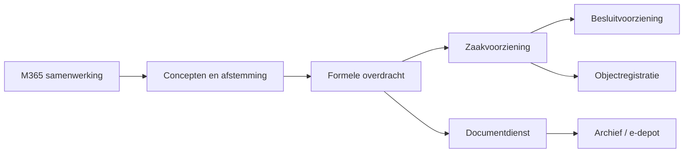

## 14.15 Samenvatting

> **Hoofdstuksamenvatting**  
> M365 is in de overheid een waardevolle samenwerkings- en productiviteitslaag, maar geen vanzelfsprekende vervanger van zaak-, dossier- of archiefvoorzieningen. De kracht van M365 ligt in samenwerking en conceptvorming; de risico’s ontstaan wanneer die informele omgeving ongemerkt de primaire drager van overheidsinformatie wordt.
>
> # 15. OneGov en de rol van ilionx

> **Kernboodschap**  
> Technologie is pas waardevol als zij bestuurlijke eenvoud, betere dienstverlening en beheersbare informatiehuishouding ondersteunt.

## 15.1 Positionering van OneGov

**OneGov** is een platform dat door ilionx wordt ingezet in de publieke sector om overheidsorganisaties te ondersteunen bij:

- zaakgericht werken,
- dienstverlening,
- procesoptimalisatie,
- en informatiebeheer.

De relevantie van OneGov ligt niet alleen in functionaliteit, maar in de ruimte tussen:

- bestuurlijke opgaven,
- uitvoeringspraktijk,
- informatiekundige inrichting,
- en technologische modernisering.

Daarom moet OneGov niet als los product worden beoordeeld, maar als onderdeel van een bredere veranderopgave.

## 15.2 OneGov in het landschap van zaakgericht werken

In een markt waar organisaties kiezen tussen traditionele suites, Common Ground-componenten, ECM-platformen en samenwerkingsomgevingen, kan OneGov worden gepositioneerd als een oplossing die helpt om:

- zaakafhandeling te structureren,
- dienstverlening te uniformeren,
- informatie in context vast te leggen,
- en aan te sluiten op de wettelijke en architecturale eisen van de overheid.

OneGov moet daarbij niet als geïsoleerd systeem worden gezien, maar als onderdeel van een architectuur waarin ook andere bouwstenen bestaan, zoals:

- portalen,
- documentdiensten,
- registraties,
- archiefvoorzieningen,
- integratielagen,
- analysetoepassingen.

## 15.3 Meerwaarde in de casus horeca-exploitatievergunning

Bij de horeca-exploitatievergunning kan OneGov helpen bij:

- intake van de aanvraag,
- controle op volledigheid,
- routering van behandeling,
- opvragen van adviezen,
- bewaken van termijnen,
- vastleggen van correspondentie,
- voorbereiden van besluitvorming,
- afhandeling van bezwaar of vervolgacties.

Maar ook hier blijft gelden: de **zaak** is het proces, niet het object. De vergunning als recht, het pand als locatie en de ondernemer als betrokkene moeten als afzonderlijke informatieobjecten herkenbaar en beheersbaar blijven.

## 15.4 OneGov en Nederlandse overheidskaders

Een bruikbare overheidsoplossing moet aantoonbaar passen binnen publieke kaders. Voor OneGov betekent dit dat de inrichting expliciet rekening moet houden met:

- Awb voor besluitvorming en termijnen,
- Woo voor openbaarheid en vindbaarheid,
- Archiefwet voor geordende en toegankelijke bewaring,
- selectielijsten voor bewaartermijnen,
- AVG voor doelbinding en minimale gegevensverwerking,
- MDTO voor metadata,
- DUTO voor duurzame toegankelijkheid,
- WMEBV en WDO voor digitale interactie,
- WCAG voor toegankelijke dienstverlening.

Een platform is pas overheidsgeschikt als deze eisen niet achteraf worden opgelapt, maar vanaf ontwerp en implementatie worden meegenomen.

## 15.5 OneGov, API’s en interoperabiliteit

Een moderne overheidsoplossing moet goed kunnen samenwerken met andere componenten. Voor OneGov is daarom van belang dat het goed aansluit op:

- ZGW API’s,
- bronregistraties,
- documentdiensten,
- publicatievoorzieningen,
- archiefkoppelingen,
- externe ketenpartners,
- managementinformatie- en analysetoepassingen.

Hoe beter deze interoperabiliteit is geregeld, hoe kleiner de kans dat OneGov verwordt tot een nieuw eiland in het landschap.

## 15.6 De rol van ilionx als strategisch partner

Hier verschuift het perspectief van product naar partnerschap. Ilionx positioneert zich met:

**Samen naar een goed geïnformeerd Nederland**

en met de claim:

**ilionx is dé (technologie) partner die burgers, bedrijven en overheid met elkaar verbindt**

Die positionering vraagt om meer dan implementatiecapaciteit. Zij vraagt om het vermogen om organisaties te begeleiden in samenhang tussen:

- beleid,
- uitvoering,
- informatiehuishouding,
- architectuur,
- en technologie.

## 15.7 Tien focusgebieden van ilionx Overheid

| Focusgebied | Relatie met zaakgericht werken en IHH |
|---|---|
| Regie op ketensamenwerking & datadeling | Zaakgericht werken stopt niet bij de organisatiegrens |
| Modernisering van dienstverlening aan burgers & bedrijven | Zaken, aanvragen en statusinformatie vormen de ruggengraat van moderne dienstverlening |
| Transparantie & verantwoording | Woo, archivering en open data vragen om vindbare en contextuele informatie |
| Veiligheid en weerbaarheid | Betrouwbare informatie is randvoorwaardelijk voor publieke dienstverlening |
| Generieke diensten: efficiëntie & kostenbeheersing | Gestandaardiseerde voorzieningen verminderen versnippering en uitvoeringslast |
| Inclusieve, toegankelijke overheid | WCAG, omnichannel en begrijpelijke dienstverlening horen in het ontwerp |
| Innovatie & adoptie van nieuwe technologie | AI, cloud, RPA en low code moeten ingebed zijn in publieke kaders |
| Vergrijzing en krapte op de arbeidsmarkt | Dossiervorming en standaardisatie beperken afhankelijkheid van individuen |
| Versnipperd IT-landschap | Architectuur en API’s helpen samenhang herstellen |
| Soevereiniteit | Technologiekeuzes moeten publieke regie ondersteunen |

## 15.8 OneGov als onderdeel van een veranderstrategie

OneGov moet niet worden gezien als een los applicatieproject. In de meeste organisaties is het onderdeel van een veranderstrategie waarin tegelijk wordt gewerkt aan:

- standaardisering,
- betere dienstverlening,
- reductie van maatwerk,
- betere dossierkwaliteit,
- verbeterde verantwoording,
- rationalisatie van applicaties,
- aansluiting op wet- en regelgeving.

Dat betekent dat succesvolle invoering meer vraagt dan configuratie. Nodig zijn ook:

- procesharmonisatie,
- gegevensmodellering,
- metadata-afspraken,
- mandaat- en besluitlogica,
- adoptiebegeleiding,
- beheerinrichting,
- archief- en Woo-governance.

## 15.9 OneGov, Microsoft en IBM: verbinden in plaats van vervangen

In veel organisaties zal OneGov niet als enige technologie aanwezig zijn. Dan ontstaat de vraag hoe het zich verhoudt tot:

- M365 als samenwerkingslaag,
- IBM / FileNet als document- of dossierfundament,
- bestaande vakapplicaties,
- integratievoorzieningen,
- portalen en burgerkanalen.

De strategische waarde van ilionx zit juist in het vermogen om die werelden met elkaar te verbinden. Niet iedere klant heeft baat bij volledige vervanging. Vaak is een hybride model realistischer en bestuurlijk verstandiger.

## 15.10 Ontwerpprincipes voor inzet van OneGov

Bij inzet van OneGov binnen de overheid zijn de volgende ontwerpprincipes behulpzaam:

- maak expliciet onderscheid tussen zaak, object, registratie en dossier;
- leg metadata vanaf het begin vast conform MDTO;
- borg bewaartermijnen via selectielijsten;
- zorg dat audit trails functioneel uitlegbaar zijn;
- behandel interoperabiliteit als eis, niet als wens;
- voorkom dat één platform verborgen meerdere rollen overneemt;
- ontwerp de burgerreis en de interne informatiehuishouding in samenhang;
- neem archivering en Woo mee vanaf de start;
- gebruik standaard waar mogelijk, maatwerk alleen waar bestuurlijk nodig;
- richt beheer en eigenaarschap vroegtijdig in.

## 15.11 Mermaid-overzicht: OneGov in bredere architectuur

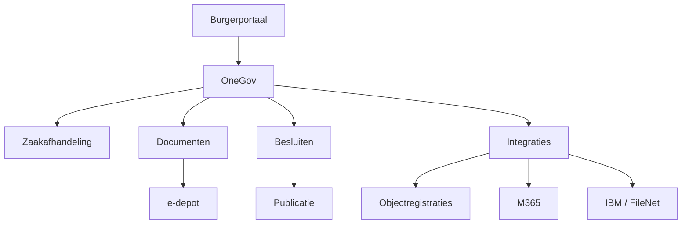

## 15.12 Samenvatting

> **Hoofdstuksamenvatting**  
> OneGov is relevant als platform in de modernisering van overheidsdienstverlening en zaakgericht werken, maar zijn waarde ontstaat pas echt wanneer het wordt ingebed in een bredere informatiekundige en bestuurlijke aanpak. Voor ilionx ligt de kracht niet alleen in het leveren van technologie, maar juist in het verbinden van burgerperspectief, wetgeving, informatiehuishouding, architectuur en implementatie.

# 16. e-Depot, archivering en overbrenging

> **Kernboodschap**  
> Het einde van een zaak is niet het einde van de verantwoordelijkheid. Juist na afronding moet blijken of informatie duurzaam toegankelijk, betrouwbaar en rechtmatig beheerd blijft.

## 16.1 Waarom archivering geen sluitstuk mag zijn

In veel organisaties wordt archivering nog gezien als een eindstap: “dat regelen we later”. Dat is gevaarlijk. Tegen de tijd dat een zaak is afgerond, zijn cruciale keuzes over context, metadata, versiebeheer en bewijslast al gemaakt — of juist niet gemaakt.

Goede archivering begint daarom niet bij het sluiten van een zaak, maar bij het ontwerp van processen, systemen en informatieobjecten.

Voor de horeca-exploitatievergunning betekent dit dat al tijdens behandeling moet vaststaan:

- welke documenten archiefwaardig zijn;
- welke metadata verplicht zijn;
- hoe de relatie tussen zaak en vergunningobject wordt vastgelegd;
- welke bewaartermijn van toepassing is;
- welke versie van het besluit authentiek is;
- hoe het dossier later reconstrueerbaar blijft.

## 16.2 Wat is een e-depot?

Een **e-depot** is een voorziening voor het duurzaam bewaren, beheren en beschikbaar houden van digitale archiefbescheiden. Het is niet simpelweg een opslaglocatie, maar een beheerde omgeving waarin duurzame toegankelijkheid centraal staat.

Officiële bronnen:

- [Nationaal Archief – e-depot](https://www.nationaalarchief.nl/archiveren/kennisbank/e-depot)
- [Nationaal Archief – DUTO](https://www.nationaalarchief.nl/archiveren/kennisbank/duurzaam-toegankelijke-overheidsinformatie-duto)

Een e-depot ondersteunt idealiter:

- ingest en opname van digitale archiefinformatie;
- validatie van metadata en bestandsformaten;
- borging van authenticiteit en integriteit;
- beheer van bewaartermijnen en overbrengingsmomenten;
- raadpleegbaarheid op langere termijn;
- migratie of preserveringsmaatregelen bij technologische veroudering.

## 16.3 Relatie tussen zaaksysteem, DMS en e-depot

Een e-depot vervangt niet automatisch een zaaksysteem of documentmanagementsysteem. De rollen verschillen fundamenteel.

| Voorziening | Primaire rol |
|---|---|
| Zaaksysteem | Processturing, termijnen, status en behandeling |
| DMS / ECM | Documentbeheer, versiebeheer, dossiervorming |
| Objectregistratie | Beheer van rechten, vergunningen, panden en relaties |
| e-depot | Duurzame bewaring, toegankelijkheid en archiefbeheer op langere termijn |

## 16.4 Overbrenging en blijvende bewaring

Niet alle informatie hoeft blijvend bewaard te worden. Selectielijsten bepalen welke informatie:

- na een bepaalde termijn vernietigd moet worden,
- tijdelijk bewaard moet blijven,
- of blijvend bewaard en uiteindelijk overgebracht moet worden.

Officiële bron:

- [Selectielijsten – Nationaal Archief](https://www.nationaalarchief.nl/archiveren/selectielijsten)

## 16.5 Duurzame toegankelijkheid volgens DUTO

DUTO vraagt meer dan technische opslag. Informatie moet ook in de toekomst nog:

- vindbaar zijn,
- interpreteerbaar zijn,
- leesbaar zijn,
- betrouwbaar zijn,
- bruikbaar zijn in de juiste context.

Dat betekent dat een los PDF-bestand zonder context geen voldoende archiefresultaat is.

## 16.6 MDTO als voorwaarde voor overbrenging

Een goede overbrenging naar een e-depot staat of valt met metadata. Daarom is MDTO niet alleen belangrijk tijdens actieve behandeling, maar ook bij archiefoverdracht.

Officiële bron:

- [MDTO – Nationaal Archief](https://www.nationaalarchief.nl/archiveren/kennisbank/metagegevens-duurzaam-toegankelijke-overheidsinformatie-mdto)

Minimaal relevant zijn metadata over:

- identificatie,
- context,
- datering,
- actor,
- proces,
- relatie,
- vorm,
- status,
- beheer,
- selectie en bewaartermijn.

## 16.7 Selectielijsten in de praktijk

Selectielijsten zijn een van de belangrijkste sturingsmechanismen in de informatiehuishouding. Zij bepalen wanneer informatie:

- vernietigd mag worden,
- vernietigd moet worden,
- bewaard moet blijven,
- of moet worden overgebracht.

In een volwassen zaakgericht landschap hoort de koppeling met selectielogica structureel onderdeel te zijn van:

- zaaktypen,
- documenttypen,
- dossiercategorieën,
- objectklassen,
- archiefprofielen.

## 16.8 Vernietiging als volwaardig onderdeel van archiefbeheer

> **Kerninzicht**  
> Vernietigen is ook een bestuurshandeling.

Binnen de overheid is vernietiging geen administratieve bijzaak, maar een expliciete en verantwoordbare handeling. Informatie die op grond van selectielijsten en bewaartermijnen vernietigd moet worden, mag niet onbeperkt blijven bestaan “voor de zekerheid”.

## 16.9 Vervanging, migratie en formatduurzaamheid

Digitale informatie blijft niet vanzelf leesbaar en bruikbaar. Daarom moet de overheid rekening houden met:

- migratie van informatie tussen systemen;
- vervanging van originele dragers of representaties;
- conversie naar duurzamer leesbare formaten;
- behoud van metadata en context bij systeemwisselingen.

Een geslaagde migratie is niet:

**“de documenten zijn meegekomen”**

maar:

**“de informatie is met context, bewijswaarde en beheerstatus bruikbaar gebleven”**

## 16.10 Operationeel dossier, archiefdossier en objecthistorie

Een belangrijk onderscheid is dat niet alle informatie in dezelfde beheerlogica blijft bestaan.

### Operationeel dossier

Ondersteunt de actuele behandeling, zoals:

- lopende correspondentie,
- concepten,
- interne afstemming,
- werknotities,
- ontvangen stukken,
- conceptbesluiten.

### Archiefdossier

De geordende, beheerde en duurzame representatie van archiefwaardige informatie.

### Objecthistorie

De levensloop van het object of recht zelf, zoals:

- de vergunning als verleend recht,
- geldigheidsduur,
- wijziging,
- intrekking,
- opvolgende besluiten,
- relatie met pand of onderneming.

## 16.11 Overbrenging onder de Archiefwet

Officiële bronnen:

- [Archiefwet 1995](https://wetten.overheid.nl/BWBR0007376/)
- [Nationaal Archief – wet- en regelgeving](https://www.nationaalarchief.nl/archiveren/wet-en-regelgeving)

Voor digitale informatie betekent overbrenging niet simpelweg dat een exportbestand wordt opgeleverd. Nodig is dat de ontvangende voorziening de informatie ook duurzaam kan beheren en dat context, structuur en authenticiteit overeind blijven.

## 16.12 Veelvoorkomende archiveringsfouten

| Fout | Gevolg |
|---|---|
| Archivering pas na livegang ontwerpen | Ontbrekende metadata en gebrekkige export |
| Alleen documenten bewaren, niet de context | Dossiers later slecht interpreteerbaar |
| Zaak afsluiten zonder selectieprofiel | Onjuiste of ontbrekende bewaartermijnen |
| Besluit buiten dossiercontext opslaan | Verlies van rechts- en bewijsrelaties |
| e-depot zien als “digitale kelder” | Onvoldoende aandacht voor raadpleegbaarheid |
| Samenwerkingsomgevingen niet meenemen | Relevante informatie raakt buiten archiefscope |
| Geen relatie leggen tussen zaak en object | Historie van rechten en besluiten versnipperd |

## 16.13 Casus: horeca-exploitatievergunning en archieflijn

Een volwassen archieflijn in deze casus ziet er ongeveer zo uit:

- de aanvraag wordt formeel ontvangen en geregistreerd;
- zaakmetadata en objectrelaties worden direct vastgelegd;
- documenten worden beheerd met versie- en contextinformatie;
- advisering en besluitvorming worden navolgbaar vastgelegd;
- het definitieve besluit krijgt een duidelijke authentieke status;
- na afronding wordt het zaakdossier geselecteerd conform selectielijst;
- relevante informatie wordt vernietigd of bewaard volgens regime;
- blijvend te bewaren informatie wordt voorbereid op overbrenging naar e-depot;
- de vergunning als object of recht blijft beheerd waar dat functioneel nodig is;
- raadpleging achteraf blijft mogelijk voor Woo, bezwaar, toezicht of verantwoording.

## 16.14 Praktische ontwerpcheck

| Vraag | Waarom relevant |
|---|---|
| Is per zaaktype duidelijk welke informatie archiefwaardig is? | Voorkomt willekeur |
| Zijn metadata conform MDTO vanaf creatie beschikbaar? | Nodig voor duurzame toegankelijkheid |
| Is de selectielijst gekoppeld aan classificatie? | Nodig voor bewaren en vernietigen |
| Is duidelijk welke versie authentiek is? | Essentieel voor bewijs |
| Zijn zaak-, object- en dossierrelaties expliciet? | Voorkomt contextverlies |
| Is export naar e-depot gespecificeerd? | Nodig voor overbrenging |
| Zijn audit trails beschikbaar en uitlegbaar? | Nodig voor controle |
| Is vernietiging bestuurlijk en technisch ingericht? | Onderdeel van rechtmatig beheer |

## 16.15 Archivering en Woo

Archivering en Woo zijn nauw verbonden. Slechte archivering leidt direct tot problemen bij:

- informatieverzoeken,
- actieve openbaarmaking,
- reconstructie van besluitvorming,
- beantwoording van bestuurlijke vragen,
- historisch onderzoek.

Een goed geordend archief is dus ook een voorwaarde voor actuele democratische verantwoording.

## 16.16 Rol van ilionx bij e-depot en archivering

Voor ilionx ligt hier een duidelijke advies- en implementatierol. Organisaties hebben vaak hulp nodig bij:

- het vertalen van Archiefwet, selectielijsten en MDTO naar systeemeisen;
- het ontwerpen van export- en overbrengingsscenario’s;
- het scheiden van operationele en archiefrollen van systemen;
- het leggen van relaties tussen zaken, documenten en objecten;
- het inrichten van metadata en selectieprofielen;
- het voorbereiden van migraties uit legacy-opslag naar beheerde archiefroutes.

## 16.17 Mermaid-overzicht: levenscyclus van een zaakdossier

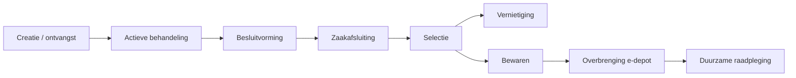

## 16.18 Samenvatting

> **Hoofdstuksamenvatting**  
> Een e-depot is geen gewone opslagvoorziening, maar een cruciale schakel in de duurzame toegankelijkheid van overheidsinformatie. Zaakgericht werken levert alleen blijvende waarde op wanneer dossiers na afronding geordend, selecteerbaar, interpreteerbaar en overdraagbaar blijven.

---

# 17. Woo, openbaarheid en actieve publicatie

> **Kernboodschap**  
> Transparantie begint niet bij het verzoek, maar bij de inrichting van de informatiehuishouding.

## 17.1 Van informatiebeheer naar openbaarheid

Openbaarheid is geen extra module boven op de informatiehuishouding. Zij is er direct van afhankelijk. Een bestuursorgaan kan alleen tijdig, zorgvuldig en navolgbaar openbaar maken als het weet:

- welke informatie het heeft;
- waar die informatie zich bevindt;
- in welke context zij is ontstaan;
- welke versies relevant zijn;
- welke metadata beschikbaar zijn;
- welke uitzonderingsgronden eventueel gelden;
- en welke informatiecategorieën actief openbaar moeten worden gemaakt.

Officiële bron:

- [Wet open overheid](https://wetten.overheid.nl/BWBR0045754/)

## 17.2 Passieve en actieve openbaarmaking

### Passieve openbaarmaking

Openbaarmaking naar aanleiding van een verzoek om informatie.

### Actieve openbaarmaking

Openbaar maken van bepaalde informatiecategorieën zonder dat eerst een verzoek nodig is.

Daarmee verschuift de ontwerpvraag van:

**“kunnen we dit terugvinden als iemand erom vraagt?”**

naar:

**“kunnen we dit op het juiste moment, in de juiste vorm en met de juiste context publiceren?”**

## 17.3 Waarom zaakgericht werken de Woo ondersteunt

Een goed ingericht zaakgericht landschap ondersteunt Woo-afhandeling doordat:

- documenten gekoppeld zijn aan procescontext;
- metadata helpen bij zoeken en selecteren;
- versies en statussen beter te onderscheiden zijn;
- behandelhistorie reconstrueerbaar is;
- besluiten en onderliggende stukken in samenhang kunnen worden beoordeeld;
- classificatie helpt bij afbakening.

## 17.4 Woo en versnipperde informatie

Woo-problemen ontstaan vaak niet door de wet zelf, maar door informatie die verspreid staat over:

- zaaksystemen,
- DMS- of ECM-opslag,
- mailboxen,
- Teams-omgevingen,
- persoonlijke schijven,
- netwerkschijven,
- vakapplicaties,
- externe samenwerkingsomgevingen.

> **Waarschuwingspunt**  
> Een Woo-proces kan nooit beter zijn dan de onderliggende informatiehuishouding.

## 17.5 Uitzonderingsgronden en zorgvuldige beoordeling

Niet alle overheidsinformatie is zonder meer openbaar. De Woo kent uitzonderingsgronden, bijvoorbeeld ter bescherming van:

- de persoonlijke levenssfeer;
- opsporings- en toezichtbelangen;
- economische of financiële belangen van de staat of andere bestuursorganen;
- bedrijfs- en fabricagegegevens;
- de goede werking van de staat in specifieke gevallen.

## 17.6 Actieve openbaarmaking als ontwerpopgave

Actieve openbaarmaking vraagt om:

- publiceerbare documentstructuren;
- herkenning van informatiecategorieën;
- duidelijke statusovergangen;
- koppeling tussen besluiten en publicatieprocessen;
- anonimisering of redactie waar nodig;
- publicatieplatformen of koppelvlakken;
- beheer van publicatieversies.

## 17.7 Casus: horeca-exploitatievergunning en Woo

Als later maatschappelijke vragen ontstaan over de verlening van een vergunning, moet de organisatie kunnen teruggrijpen op een navolgbaar dossier.

Relevant kunnen zijn:

- de aanvraag;
- aangeleverde bijlagen;
- interne adviezen;
- besluitnota’s;
- het formele besluit;
- correspondentie over aanvullingen;
- eventuele bezwaarstukken;
- publicatie of bekendmaking.

## 17.8 Woo, metadata en vindbaarheid

Metadata zijn in Woo-processen geen luxe, maar een voorwaarde. Denk aan:

- zaaknummer;
- documenttype;
- datum ontvangst;
- datum besluit;
- opsteller;
- betrokken organisatieonderdelen;
- zaakstatus;
- relatie met object of vergunning;
- openbaarheidsstatus of gevoeligheidsindicatie waar passend.

## 17.9 Openbaarheid en open data

De Woo raakt ook aan bredere vragen over hergebruik van overheidsinformatie en open data. Niet alle openbaar gemaakte informatie is direct open data, maar een volwassen overheid denkt wel na over:

- herbruikbaarheid;
- machineleesbaarheid;
- standaardisatie;
- publiceerbare metadata;
- context voor burgers, journalisten en onderzoekers.

## 17.10 Publicatievoorzieningen en softwarelandschap

| Voorziening | Rol in openbaarheid |
|---|---|
| Zaakvoorziening | Vastleggen van procescontext en statussen |
| DMS / Documentdienst | Beheer van documenten en metadata |
| Besluitvoorziening | Vastleggen van formele besluiten |
| Publicatievoorziening | Publiceren, tonen en ontsluiten |
| Archief / e-depot | Duurzame beschikbaarheid op langere termijn |
| Zoek- en indexdiensten | Vindbaarheid over bronnen heen |

## 17.11 Veelvoorkomende Woo-problemen

| Probleem | Gevolg |
|---|---|
| Documenten zonder context | Onjuiste of onvolledige beoordeling |
| Informatie verspreid over veel systemen | Hoge zoeklast en lange doorlooptijden |
| Onduidelijk verschil tussen concept en definitief | Risico op verkeerde openbaarmaking |
| Geen relatie tussen zaak en object | Onvolledige reconstructie van besluitvorming |
| Geen metadata- of classificatiediscipline | Moeilijk afbakenen |
| Publicatie als handmatige bijzaak | Inconsistente actieve openbaarmaking |
| Geen audit trail op openbaarmakingsbesluiten | Beperkte verantwoording achteraf |

## 17.12 Rol van ilionx bij Woo-vraagstukken

Voor ilionx ligt de waarde niet alleen in software, maar vooral in het helpen ontwerpen van een Woo-bestendige informatiehuishouding. Dat betekent onder meer:

- Woo-eisen vertalen naar informatiearchitectuur;
- metadata en classificatie praktisch uitvoerbaar maken;
- publicatie- en besluitketens op elkaar laten aansluiten;
- onderscheid maken tussen operationele, archief- en publicatiecontext;
- ondersteuning bieden bij integratie tussen zaaksystemen, DMS, M365, IBM-landschappen en publicatievoorzieningen;
- organisaties helpen om actieve openbaarmaking als ontwerpprincipe te behandelen.

## 17.13 Mermaid-overzicht: Woo-keten


## 17.14 Samenvatting

> **Hoofdstuksamenvatting**  
> De Woo maakt zichtbaar of de informatiehuishouding van een overheidsorganisatie werkelijk op orde is. Openbaarheid begint niet bij het verzoek, maar bij de manier waarop informatie ontstaat, wordt geclassificeerd, vindbaar blijft en in context kan worden beoordeeld.
>
> # 18. Toegankelijkheid, inclusie en digitale dienstverlening

> **Kernboodschap**  
> Digitale overheid is pas publieke dienstverlening als iedereen mee kan doen.

## 18.1 Waarom toegankelijkheid meer is dan een norm

Toegankelijkheid wordt soms te smal opgevat als een lijst technische eisen voor websites en formulieren. Dat is onvolledig. Toegankelijkheid betekent in overheidscontext ook:

- begrijpelijke taal,
- voorspelbare processtappen,
- bruikbare digitale formulieren,
- ondersteuning van verschillende kanalen,
- inclusie van burgers met beperkte digitale vaardigheden,
- toegankelijkheid voor mensen met visuele, auditieve, motorische of cognitieve beperkingen,
- navolgbare statusinformatie,
- en dienstverlening zonder onnodige drempels.

## 18.2 WCAG als minimumeis, niet als einddoel

De **Web Content Accessibility Guidelines (WCAG)** vormen het formele referentiekader voor digitale toegankelijkheid.

Officiële bron:

- [DigiToegankelijk](https://www.digitaleoverheid.nl/onderwerpen/digitoegankelijk/)

Voor overheidsorganisaties zijn WCAG-eisen relevant voor onder meer:

- websites,
- portalen,
- formulieren,
- statuspagina’s,
- documenten,
- en applicaties voor digitale interactie.

Maar WCAG-conformiteit alleen is niet voldoende. Een formulier kan technisch toegankelijk zijn en toch praktisch onbruikbaar door:

- jargon,
- onduidelijke beslislogica,
- te veel verplichte velden,
- onbegrijpelijke foutmeldingen,
- onheldere vervolgacties,
- gebrek aan context.

> **Kerninzicht**  
> Toegankelijkheid is niet alleen een eigenschap van het scherm, maar van de hele dienst.

## 18.3 Inclusie als ontwerpprincipe

Digitale inclusie betekent dat de overheid erkent dat niet iedere burger dezelfde vaardigheden, middelen of voorkeuren heeft. Een volwassen dienstverleningsontwerp houdt rekening met verschillen in:

- taalvaardigheid,
- digitale vaardigheid,
- cognitieve belasting,
- beschikbare apparatuur,
- vertrouwen in de overheid,
- behoefte aan persoonlijk contact,
- context van gebruik.

## 18.4 Omnichannel in plaats van kanaaldwang

Een toegankelijke overheid werkt **omnichannel**. Dat betekent niet dat elk kanaal exact hetzelfde doet, maar wel dat de burger niet verdwaalt tussen loket, telefoon, e-mail, webformulier, post en balie.

Voor zaakgericht werken betekent dit dat verschillende kanalen moeten kunnen samenkomen in één consistente zaak- en dossierstructuur.

## 18.5 Begrijpelijke dienstverlening

Begrijpelijke dienstverlening vraagt onder meer:

- uitleg van het doel van de aanvraag;
- helder onderscheid tussen verplichte en optionele stukken;
- uitleg over termijnen;
- uitleg over gegevensgebruik;
- duidelijke ontvangstbevestiging;
- navolgbare statusberichten;
- begrijpelijke motivering van besluiten;
- heldere informatie over bezwaar en beroep.

## 18.6 Zaakgericht werken als motor voor voorspelbaarheid

Goed zaakgericht werken ondersteunt inclusieve dienstverlening doordat het voorspelbaarheid creëert. Dat levert concreet op:

- betere ontvangstbevestigingen;
- consistente statusinformatie;
- minder afhankelijkheid van individuele medewerkers;
- duidelijker verwachtingen;
- snellere beantwoording van vragen;
- betere overdraagbaarheid tussen kanalen;
- minder kans op tegenstrijdige communicatie.

## 18.7 Toegankelijke documenten en besluiten

Niet alleen websites en portalen moeten toegankelijk zijn. Ook documenten die burgers ontvangen of raadplegen moeten bruikbaar zijn, zoals:

- ontvangstbevestigingen,
- informatieverzoeken,
- verzoeken om aanvulling,
- beschikkingen,
- publicaties,
- bezwaarbesluiten.

## 18.8 Toegankelijkheid en het digitale landschap

Toegankelijkheid raakt het hele digitale landschap:

- burgerportalen,
- formulieren,
- documentgeneratie,
- klantcontactomgevingen,
- interne behandelschermen,
- koppelingen tussen frontoffice en backoffice.

## 18.9 Digitale identiteit, betrouwbaarheid en gebruiksgemak

Toegankelijke digitale dienstverlening moet ook betrouwbaar zijn. Burgers en bedrijven moeten weten:

- dat zij met de echte overheid communiceren;
- dat hun bericht goed is ontvangen;
- dat hun identiteit passend is vastgesteld waar nodig;
- dat hun aanvraag niet verdwijnt in een ondoorzichtige keten.

## 18.10 Casus: horeca-exploitatievergunning als burgerreis

Een toegankelijke burgerreis bevat idealiter:

- begrijpelijke uitleg van de vergunning en voorwaarden;
- een helder aanvraagkanaal;
- ondersteuning bij het aanleveren van stukken;
- duidelijke ontvangstbevestiging;
- inzicht in de voortgang;
- begrijpelijke verzoeken om aanvulling;
- een navolgbaar besluit;
- informatie over bezwaar, beroep of vervolgacties.

## 18.11 WCAG, publicatie en openbaarheid

Er bestaat een directe relatie tussen digitale toegankelijkheid en openbaarheid. Informatie die formeel openbaar is, maar feitelijk slecht toegankelijk, beperkt de democratische waarde van die openbaarheid.

## 18.12 Veelvoorkomende valkuilen

| Valkuil | Gevolg |
|---|---|
| Toegankelijkheid beperken tot websitecontrole | Proces en documenten blijven onbruikbaar |
| Kanaaldwang richting alleen digitaal | Uitsluiting van minder digitaal vaardige burgers |
| Juridisch correcte maar onbegrijpelijke taal | Minder vertrouwen en meer herstelverkeer |
| Statusinformatie alleen intern bruikbaar | Burgers blijven bellen voor duidelijkheid |
| Formulieren zonder context of hulp | Meer fouten en onvolledige aanvragen |
| Geen samenhang tussen kanalen | Tegenstrijdige communicatie en versnipperde dossiervorming |
| Publicatie zonder toegankelijke opmaak | Beperkte feitelijke openbaarheid |

## 18.13 Rol van ilionx bij inclusieve digitale dienstverlening

Voor ilionx betekent dit onder meer:

- toegankelijkheid als ontwerpprincipe meenemen in architectuur en implementatie;
- zaakgericht werken verbinden met burgerreizen;
- kanaalintegratie ondersteunen zonder procescontext te verliezen;
- WCAG, WDO en WMEBV vertalen naar concrete ontwerpkeuzes;
- statusinformatie, berichtgeving en documentgeneratie begrijpelijk inrichten;
- organisaties helpen inclusie niet als compliance-thema, maar als kwaliteitsvraagstuk te behandelen.

## 18.14 Mermaid-overzicht: burgerreis horeca-exploitatievergunning

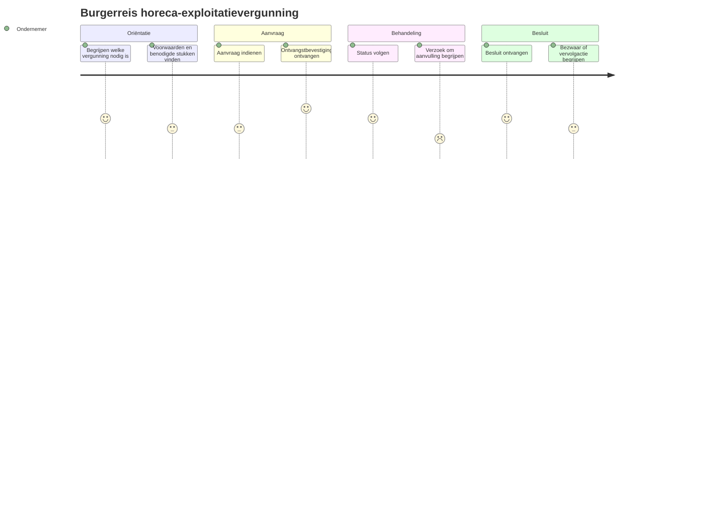

## 18.15 Samenvatting

> **Hoofdstuksamenvatting**  
> Toegankelijkheid en inclusie zijn geen bijzaak, maar een wezenlijk onderdeel van zaakgericht werken en digitale overheidsdienstverlening. Een proces is pas echt goed ingericht als burgers en bedrijven het kunnen begrijpen, gebruiken en volgen — ongeacht kanaal, vaardigheidsniveau of beperking.

---

# 19. UWV en de Verandermotor

> **Kernboodschap**  
> Grootschalige publieke vernieuwing laat zien dat zaakgericht werken, informatiehuishouding, architectuur en menselijke maat niet los van elkaar kunnen worden ontwikkeld.

## 19.1 Waarom UWV in dit handboek thuishoort

Het UWV is relevant voor zaakgericht werken en informatiehuishouding omdat hier meerdere spanningen tegelijk zichtbaar worden:

- hoge volumes en maatschappelijke gevoeligheid;
- complexe wet- en regelgeving;
- grote afhankelijkheid van legacy-landschappen;
- noodzaak tot betere dienstverlening;
- druk op uitvoerbaarheid en vakmanschap;
- groeiende behoefte aan transparantie, herleidbaarheid en wendbaarheid.

## 19.2 De Verandermotor als organisatiefilosofie

De Verandermotor moet niet alleen worden gelezen als naam van een programma, maar als uitdrukking van een bredere veranderfilosofie. In de kern gaat het om het vergroten van het vermogen van de organisatie om:

- sneller te verbeteren;
- beter samen te werken;
- beter aan te sluiten op maatschappelijke en politieke opgaven;
- technologie, uitvoering en dienstverlening meer in samenhang te ontwikkelen.

## 19.3 Relevante documenten

| Document | Type | Relevantie |
|---|---|---|
| Adviesaanvraag De Verandermotor (2024) | Officieel besluitstuk | Integraal hoofdlijnenontwerp, doelstellingen en structuur |
| UWV Jaarplan 2025 | Beleidsplan | Implementatieambities en koppeling met strategie |
| UWV Informatieplan 2024-2028 | ICT-strategie | Kader voor technologische vernieuwing |
| Woo-besluit Verandermotor | Woo-publicatie | Interne analyses, faalfactoren en besturingsmodellen |
| Het Verhaal van de Verandermotor | Communicatie | Visie achter de verandering, gericht op menselijke maat |

## 19.4 De menselijke maat als stuurprincipe

In de context van uitvoeringsorganisaties betekent de menselijke maat concreet dat:

- burgers niet verdwijnen achter systeemlogica;
- uitzonderingen uitlegbaar en behandelbaar blijven;
- medewerkers ruimte houden voor professioneel oordeel;
- informatievoorziening niet alleen efficiënt, maar ook rechtvaardig is.

## 19.5 Legacy, modernisering en uitvoeringscontinuïteit

Een van de grootste lessen uit grote uitvoeringsorganisaties is dat modernisering meestal plaatsvindt onder volledige productiebelasting. Systemen moeten worden vernieuwd terwijl de dienstverlening doorgaat.

Dat vraagt aandacht voor:

- legacy-ontsluiting,
- gefaseerde vervanging,
- integratielagen,
- containerplatformen,
- API-strategieën,
- beheersing van overgangsrisico’s.

## 19.6 Relatie met informatiehuishouding

Bij een traject als de Verandermotor is informatiehuishouding geen ondersteunend thema, maar een randvoorwaarde. Zonder goede informatiehuishouding ontstaan onvermijdelijk problemen in:

- besluitreconstructie,
- burgercommunicatie,
- overdraagbaarheid,
- sturing op prestaties,
- verantwoording,
- Woo-afhandeling.

## 19.7 Zaakgericht werken in een UWV-context

Ook in een organisatie als UWV zijn vragen relevant als:

- wat is de aanleiding van de behandeling?
- wat is het beoogde resultaat?
- welke termijnen gelden?
- welke gegevens en documenten zijn gebruikt?
- welk besluit is genomen?
- welk object of recht blijft daarna relevant?
- hoe wordt het dossier navolgbaar bewaard?

## 19.8 Verandermotor en architectuur

Belangrijke architectuurvragen zijn:

- welke functies moeten stabiel en generiek zijn?
- welke processen vragen domeinspecifieke uitwerking?
- waar horen gegevens thuis?
- hoe worden brongegevens ontsloten?
- hoe voorkomen we nieuwe monolieten?
- hoe borgen we vervangbaarheid en uitlegbaarheid?

## 19.9 Verandervermogen als productiefactor

Voor grote uitvoeringsorganisaties betekent verandervermogen dat niet alleen de operatie moet draaien, maar dat de organisatie ook herhaalbaar moet kunnen verbeteren.

Daarvoor zijn nodig:

- duidelijk eigenaarschap van processen en informatie;
- betere samenwerking tussen business en IT;
- sturing op samenhang in plaats van losse projecten;
- standaardisatie waar mogelijk;
- ruimte voor iteratieve vernieuwing;
- governance die zowel continuïteit als modernisering ondersteunt.

## 19.10 Woo, verantwoording en publieke zichtbaarheid

Juist bij grote veranderprogramma’s groeit de publieke en politieke belangstelling. Dat maakt ook de Woo-relevantie groter. Interne analyses, ontwerpkeuzes, risico-inschattingen en governance-afspraken kunnen onderwerp worden van openbaarmaking.

## 19.11 Technologische facilitering

Het UWV Informatieplan 2024-2028 maakt duidelijk dat technologische vernieuwing geen doel op zich is, maar een enabler voor:

- uitvoerbaarheid,
- wendbaarheid,
- betere dienstverlening.

## 19.12 Rol van ilionx bij vergelijkbare trajecten

Hoewel de Verandermotor UWV-specifiek is, zijn de lessen breder toepasbaar. Voor ilionx ligt de toegevoegde waarde in:

- het verbinden van veranderstrategie en informatiearchitectuur;
- het expliciteren van zaak-, object- en dossierbegrippen;
- het helpen ontwerpen van hybride moderniseringspaden;
- het ontsluiten van legacy via API’s en platformen zoals Red Hat OpenShift;
- het borgen van Woo-, Archiefwet- en MDTO-eisen;
- het begeleiden van organisaties in de overgang van projectmatig naar structureel verandervermogen.

## 19.13 Mermaid-overzicht: Verandermotor als samenhang

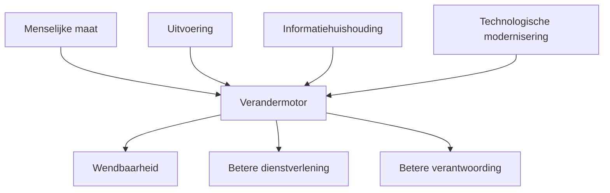

## 19.14 Samenvatting

> **Hoofdstuksamenvatting**  
> De Verandermotor laat zien dat vernieuwing in grote uitvoeringsorganisaties veel meer is dan systeemvervanging. Het gaat om het herontwerpen van samenhang tussen dienstverlening, informatiehuishouding, architectuur, besturing en technologie — onder de druk van continuïteit, maatschappelijke verwachtingen en publieke verantwoording.
>
> # 20. ilionx Overheid: strategische partner in de publieke sector

> **Kernboodschap**  
> In de publieke sector is technologie zelden het echte vraagstuk. De werkelijke uitdaging ligt in het verbinden van bestuurlijke opgaven, uitvoering, informatiehuishouding, architectuur en verandervermogen.

## 20.1 Positionering van ilionx

Ilionx positioneert zich als de partner die burgers, bedrijven en overheid met elkaar verbindt. Voor dit handboek betekent dat concreet dat ilionx niet alleen software levert of implementeert, maar helpt bij het ontwerpen van een samenhangende informatievoorziening.

## 20.2 Tien focusgebieden als publieke agenda

| Focusgebied | Betekenis in dit handboek |
|---|---|
| Regie op ketensamenwerking & datadeling | Zaakgericht werken eindigt niet aan de organisatiegrens |
| Modernisering van dienstverlening aan burgers & bedrijven | Processen moeten begrijpelijk, navolgbaar en digitaal ondersteund zijn |
| Transparantie & verantwoording | Woo, open data, archivering en publicatie vragen om informatie op orde |
| Veiligheid en weerbaarheid | Betrouwbare publieke dienstverlening vraagt robuuste informatievoorziening |
| Generieke diensten: efficiëntie & kostenbeheersing | Standaardisatie vermindert versnippering en beheerlast |
| Inclusieve, toegankelijke overheid | Toegankelijkheid en omnichannel horen in het ontwerp van processen |
| Innovatie & adoptie van nieuwe technologie | AI, cloud, RPA en low code moeten bestuurlijk verantwoord worden ingezet |
| Vergrijzing + krapte op arbeidsmarkt | Processtandaardisatie en dossiervorming helpen kennis borgen |
| Versnipperd IT-landschap | Architectuur en API’s helpen samenhang herstellen |
| Soevereiniteit | Overheid moet regie houden op data, afhankelijkheden en uitwisselbaarheid |

## 20.3 Van implementatiepartner naar strategisch partner

Een uitvoeringspartner levert capaciteit. Een strategisch partner helpt keuzes expliciet te maken.

Voor ilionx betekent dat ondersteuning bij vragen als:

- welk probleem lossen we bestuurlijk eigenlijk op?
- waar zit het echte knelpunt: proces, informatie, systeem of governance?
- wat is het juiste onderscheid tussen zaak, object, registratie en dossier?
- welke standaarden en architectuurprincipes moeten leidend zijn?
- hoe moderniseren we zonder nieuwe schuld te creëren?
- hoe borgen we Woo, Archiefwet, AVG en toegankelijkheid vanaf het begin?

## 20.4 Ilionx en hybride modernisering

Veel overheidsorganisaties werken niet vanuit een leeg blad. Zij hebben een mengvorm van:

- legacy-systemen,
- vakapplicaties,
- M365-omgevingen,
- ECM- of IBM-landschappen,
- zaaksystemen,
- integratievoorzieningen,
- nieuwe API-gedreven componenten.

Daarom is hybride modernisering vaak realistischer dan radicale vervanging.

## 20.5 Ilionx en Red Hat OpenShift

Binnen moderne overheidsarchitecturen speelt platformtechnologie een steeds grotere rol. **Red Hat OpenShift** is relevant als fundament voor:

- containerisatie,
- schaalbaarheid,
- portabiliteit,
- modern applicatiebeheer.

## 20.6 Ilionx en IBM-expertise

In complexe publieke organisaties is IBM-kennis nog altijd relevant. Dat geldt vooral waar schaal, compliance, documentintensiteit en legacy-integratie samenkomen.

## 20.7 Ilionx en Microsoft in de overheid

Ook in M365-vraagstukken ligt de waarde van ilionx niet in productimplementatie alleen, maar in positionering en governance.

## 20.8 Ilionx en OneGov

Met OneGov heeft ilionx ook een eigen positie in het landschap van zaakgericht werken en publieke dienstverlening. De meerwaarde ontstaat vooral wanneer OneGov niet als los product, maar als onderdeel van een bredere publieke architectuur wordt ingezet.

## 20.9 Soevereiniteit en publieke regie

Een terugkerend vraagstuk in de overheidsmarkt is **soevereiniteit**: in hoeverre houdt de overheid grip op haar gegevens, processen, afhankelijkheden en verandervermogen?

## 20.10 Kennisborging in een krappe arbeidsmarkt

De vergrijzing en de krapte op de arbeidsmarkt maken kennisborging tot een strategisch thema. Informatiehuishouding speelt daar een directe rol in.

## 20.11 Ilionx als brug tussen beleid, uitvoering en technologie

Misschien wel de belangrijkste partnerrol van ilionx is de brugfunctie tussen werelden die in overheidsorganisaties vaak uit elkaar zijn gegroeid:

- beleid en uitvoering;
- bestuur en operatie;
- informatiehuishouding en IT;
- juridische eisen en gebruikerspraktijk;
- legacy en innovatie.

## 20.12 Mermaid-overzicht: partnerrol van ilionx

```mermaid
flowchart TD
    A[Bestuurlijke opgave] --> E[ilionx]
    B[Uitvoering] --> E
    C[Informatiehuishouding] --> E
    D[Technologie] --> E
    E --> F[Architectuur]
    E --> G[Implementatie]
    E --> H[Adoptie]
    E --> I[Verantwoording]
```

## 20.13 Samenvatting

> **Hoofdstuksamenvatting**  
> Ilionx is in de publieke sector het meest waardevol waar het verder gaat dan implementatie en optreedt als strategisch partner in samenhangende modernisering. De combinatie van informatiekunde, architectuur, platformkennis, legacy-ontsluiting en publieke domeinkennis maakt het mogelijk om organisaties te helpen bij echte verbeteringen in dienstverlening en informatiehuishouding.

---

# 21. Implementatie-aanpak voor medewerkers en organisaties

> **Kernboodschap**  
> Zaakgericht werken slaagt pas als mensen, processen en informatie echt meebewegen.

## 21.1 Begin niet bij het systeem, maar bij de opgave

De eerste stap in een volwassen implementatie is niet de selectie van een applicatie, maar het expliciteren van de opgave. Denk aan vragen als:

- welk burger- of bedrijfsprobleem willen we beter oplossen?
- waar stokt de huidige dienstverlening?
- welke informatie kunnen we nu niet goed terugvinden of verantwoorden?
- waar lopen Woo, Archiefwet of AVG in de praktijk vast?
- welke processen zijn te persoonsafhankelijk?
- waar belemmert het landschap wendbaarheid of transparantie?

## 21.2 Werk vanuit de Gouden Cirkel

### Waarom

- beter burgervertrouwen;
- meer transparantie;
- betere dienstverlening;
- rechtmatiger besluitvorming;
- informatie op orde;
- minder uitvoeringsrisico.

### Hoe

- architectuurprincipes;
- informatiemodellen;
- metadata;
- standaarden;
- governance;
- rollen en verantwoordelijkheden.

### Wat

- platformen;
- koppelingen;
- processen;
- formulieren;
- schermen;
- rapportages;
- beheerinrichting.

## 21.3 Start met één herkenbare casus

De casus van de horeca-exploitatievergunning laat zien waarom een concrete startcasus zo krachtig is.

Een goede startcasus is:

- bestuurlijk relevant;
- herkenbaar voor medewerkers;
- juridisch betekenisvol;
- representatief voor bredere ontwerpkeuzes;
- beperkt genoeg om beheersbaar te blijven.

## 21.4 Maak definities expliciet en niet onderhandelbaar

Kernbegrippen moeten vroeg in het traject expliciet worden gemaakt:

- wat verstaan we onder een registratie?
- wat is precies een zaak?
- wat is een object?
- wat is een case of dossier?
- wanneer is iets een formeel document?
- wanneer is iets een werkdocument of concept?

## 21.5 Richt governance vroeg in

Al vroeg moet duidelijk zijn:

- wie proceseigenaar is;
- wie informatie-eigenaar is;
- wie verantwoordelijk is voor metadata en classificatie;
- wie selectielogica beheert;
- wie publicatie en Woo raakt;
- wie veranderingen in zaaktypen of formulieren autoriseert;
- wie integraal zicht houdt op samenhang.

## 21.6 Neem Woo en archivering vanaf dag één mee

Dat betekent concreet:

- metadata vanaf creatie;
- dossiervorming in context;
- selectielijsten gekoppeld aan zaaktypen;
- audit trails expliciet ontworpen;
- onderscheid tussen concept en definitief;
- publicatie- en archiefroutes meegenomen;
- exporteerbaarheid geborgd.

## 21.7 Gebruik standaarden als versnellingsmechanisme

Relevant zijn onder meer:

- MDTO voor metadata,
- DUTO voor duurzame toegankelijkheid,
- NEN 2084:2024 voor informatie- en functionaliteitsordening,
- ZGW API’s voor interoperabiliteit,
- NORA, RORA en GEMMA voor architectuurkaders.

## 21.8 Werk iteratief, maar niet stuurloos

Een goede iteratieve aanpak kent twee snelheden:

- stabiele kaders voor architectuur, informatie, metadata en governance;
- wendbare uitwerking in schermen, formulieren, koppelingen en gebruikersprocessen.

## 21.9 Leid medewerkers op in betekenis, niet alleen in klikken

Medewerkers moeten begrijpen:

- waarom metadata ertoe doen;
- waarom zaak, object en dossier niet hetzelfde zijn;
- waarom selectielijsten relevant zijn;
- waarom een besluit correct moet worden vastgelegd;
- waarom samenwerkingsomgevingen niet vanzelf het formele dossier zijn;
- hoe hun handelingen later doorwerken in Woo, bezwaar, archivering en verantwoording.

## 21.10 Meet niet alleen snelheid, maar ook informatiekwaliteit

Zinnige indicatoren zijn bijvoorbeeld:

- volledigheid van metadata;
- percentage zaken met correct selectieprofiel;
- navolgbare besluitvastlegging;
- tijd voor Woo-reconstructie;
- kwaliteit van dossierrelaties;
- aantal handmatige herstelacties;
- overdraagbaarheid tussen medewerkers of teams.

## 21.11 Implementatie in een hybride landschap

Veel organisaties implementeren zaakgericht werken in een omgeving waarin meerdere stacks naast elkaar bestaan. Dat vraagt expliciet aandacht voor:

- M365 als samenwerkingslaag;
- IBM / FileNet of andere ECM-oplossingen;
- bestaande vakapplicaties;
- portalen en formulieren;
- objectregistraties;
- publicatievoorzieningen;
- archief- of e-depotroutes.

## 21.12 Rol van leidinggevenden en medewerkers

### Leidinggevenden moeten

- het waarom van de verandering blijven herhalen;
- sturen op samenhang in plaats van lokale optimalisatie;
- ruimte maken voor standaardisering;
- voorbeeldgedrag tonen.

### Medewerkers moeten

- informatie bewust vastleggen;
- onderscheid maken tussen werkruimte en formeel dossier;
- zorgvuldig omgaan met status, besluiten en context;
- signaleren waar proces of systeem onduidelijkheid creëert.

## 21.13 Implementatiepatroon in fasen

| Fase | Hoofdvraag | Resultaat |
|---|---|---|
| 1. Opgavebepaling | Waarom veranderen we? | Gedeelde bestuurlijke en uitvoeringsopgave |
| 2. Proces- en informatieanalyse | Wat moet anders? | Scherp ontwerpbeeld |
| 3. Architectuur en standaarden | Hoe borgen we samenhang? | Kaders en ontwerpprincipes |
| 4. Platform- en integratiekeuze | Welke bouwstenen passen? | Doelarchitectuur en veranderpad |
| 5. Inrichting en pilot | Werkt het in een concrete casus? | Geteste oplossing |
| 6. Opschaling | Hoe verbreden we? | Herhaalbare implementatieaanpak |
| 7. Borging en optimalisatie | Hoe houden we kwaliteit vast? | Beheer, governance en verbetering |

## 21.14 Rol van ilionx bij implementatie

Voor ilionx ligt hier een natuurlijke rol als partner die samenbrengt:

- bestuurlijke analyse;
- informatiearchitectuur;
- procesontwerp;
- platformkennis;
- integratie;
- adoptie;
- beheerinrichting.

## 21.15 Mermaid-overzicht: implementatiefasen

```mermaid
flowchart LR
    A[1. Opgave] --> B[2. Analyse]
    B --> C[3. Architectuur]
    C --> D[4. Platformkeuze]
    D --> E[5. Pilot]
    E --> F[6. Opschaling]
    F --> G[7. Borging]
```

## 21.16 Samenvatting

> **Hoofdstuksamenvatting**  
> Een succesvolle implementatie van zaakgericht werken begint niet bij software, maar bij een gedeelde opgave en een scherp begrip van proces, informatie en verantwoordelijkheid. Pas daarna volgen architectuur, standaarden, platformkeuzes en adoptie.
>
> ```markdown
# 22. Praktische valkuilen en ontwerpprincipes

> **Veel mislukkingen zijn voorspelbaar**  
> Zaakgericht werken mislukt zelden door één grote fout. Meestal gaat het mis door een reeks kleine ontwerpkeuzes, aannames en omissies die samen leiden tot een systeem dat technisch draait, maar bestuurlijk of informatiekundig tekortschiet.

Dit hoofdstuk bundelt daarom de meest voorkomende valkuilen én de bijbehorende ontwerpprincipes.

## 22.1 Valkuil: het zaaksysteem als wondermiddel zien

Een veelvoorkomende denkfout is dat de aanschaf van een zaaksysteem automatisch leidt tot zaakgericht werken. In werkelijkheid kan een organisatie ook met een modern systeem nog steeds:

- onduidelijke dossiers hebben;
- slechte metadata toepassen;
- objecten en zaken verwarren;
- Woo-problemen houden;
- en archivering verkeerd inrichten.

### Ontwerpprincipe

Behandel het zaaksysteem als één bouwsteen in een bredere informatiearchitectuur. Proceslogica, besluitvorming, objectbeheer, archivering en publicatie moeten expliciet worden ontworpen.

## 22.2 Valkuil: registratie verwarren met proces

Wanneer organisaties vooral sturen op velden, statuscodes en administratieve vastlegging, ontstaat de indruk dat het proces beheerst is. Maar registratie is nog geen behandeling.

### Ontwerpprincipe

Ontwerp altijd vanuit:

- aanleiding;
- behandeldoel;
- processtappen;
- besluitmomenten;
- termijnen;
- en uitkomst.

Pas daarna volgt de administratieve registratie.

## 22.3 Valkuil: zaak en object door elkaar halen

Dit is een van de meest fundamentele fouten. Een vergunningaanvraag is een zaak. De verleende vergunning is een object of rechtstoestand. Wie dit vermengt, krijgt problemen met:

- historie;
- vervolgprocessen;
- objectbeheer;
- bewaartermijnen;
- en reconstructie.

### Ontwerpprincipe

Leg expliciet relaties vast tussen:

- zaak;
- object;
- registratie;
- besluit;
- document;
- en dossier.

De casus horeca-exploitatievergunning moet hierin voor iedere medewerker herkenbaar zijn.

## 22.4 Valkuil: alles in één dossierbak stoppen

Sommige organisaties lossen samenhang op door alles simpelweg bij elkaar te bewaren. Dat lijkt overzichtelijk, maar maakt onderscheid tussen formeel dossier, werkruimte, objecthistorie en archiefstatus juist onduidelijk.

### Ontwerpprincipe

Maak onderscheid tussen:

- operationeel dossier;
- formeel zaakdossier;
- archiefdossier;
- objecthistorie;
- samenwerkingsruimte;
- en publicatiecontext.

Samenhang is belangrijk, maar samenvoegen is niet altijd de juiste oplossing.

## 22.5 Valkuil: M365 of netwerkschijven als primair dossier gebruiken

Gebruiksgemak verleidt organisaties ertoe om Teams, SharePoint, netwerkschijven of mailboxen als feitelijk dossier te laten functioneren. Dat leidt vrijwel altijd tot contextverlies en beheerrisico’s.

### Ontwerpprincipe

Positioneer samenwerkingsomgevingen expliciet als werklaag, niet automatisch als formele dossierlaag. Zorg voor heldere overdracht naar zaak-, document- of archiefvoorzieningen.

## 22.6 Valkuil: Woo en archivering later willen regelen

Wanneer openbaarmaking, metadata, selectielijsten en archivering pas na livegang worden toegevoegd, blijken cruciale relaties en context vaak al verloren.

### Ontwerpprincipe

Neem Woo, MDTO, DUTO, selectielogica en archiefroutes vanaf het begin mee in procesontwerp en systeeminrichting.

## 22.7 Valkuil: generiek casemanagement zonder publieke specificatie

Flexibiliteit klinkt aantrekkelijk, maar een generiek caseplatform zonder expliciete inrichting voor Awb, termijnen, besluiten, archivering en objectrelaties is geen volwassen publieke voorziening.

### Ontwerpprincipe

Gebruik flexibiliteit alleen binnen duidelijke publieke kaders. Zorg dat Nederlandse eisen rond rechtmatigheid, besluitvorming, verantwoording en duurzame toegankelijkheid expliciet zijn gemodelleerd.

## 22.8 Valkuil: metadata zien als administratieve last

Als metadata worden ervaren als extra invulwerk zonder betekenis, zal de kwaliteit dalen.

### Ontwerpprincipe

Maak metadata functioneel zichtbaar. Laat medewerkers merken dat goede metadata nodig zijn voor:

- zoekbaarheid;
- statusinformatie;
- Woo;
- archivering;
- rapportage;
- en overdraagbaarheid.

Automatiseer waar mogelijk, maar zonder betekenis te verliezen.

## 22.9 Valkuil: audit trails technisch maar onbegrijpelijk maken

Een logbestand dat alleen technisch specialisten kunnen uitlezen, helpt juristen, auditors en behandelaars beperkt.

### Ontwerpprincipe

Richt audit trails zo in dat zij zowel technisch betrouwbaar als functioneel uitlegbaar zijn. Leg vast:

- wie;
- wat;
- wanneer;
- waarom;
- in welke zaak, op welk object of document;
- en met welk resultaat.

## 22.10 Valkuil: integratie verwarren met kopiëren

In veel landschappen wordt “integratie” feitelijk ingevuld als data kopiëren tussen systemen. Dat leidt tot synchronisatieproblemen en onduidelijkheid over de bron.

### Ontwerpprincipe

Werk waar mogelijk volgens Common Ground-principes:

- data bij de bron;
- functies ontkoppelen;
- API’s gebruiken;
- duplicatie beperken;
- bronverantwoordelijkheid respecteren.

## 22.11 Valkuil: leverancierstaal overnemen zonder vertaling naar de overheid

Leveranciers spreken over cases, content, workflows, tasks, records of customer journeys. Dat kan nuttig zijn, maar wordt gevaarlijk als de overheid die taal overneemt zonder te toetsen aan eigen juridische en informatiekundige kaders.

### Ontwerpprincipe

Vertaal leveranciersconcepten altijd terug naar publieke begrippen zoals:

- zaak;
- besluit;
- object;
- dossier;
- archiefbescheid;
- bewaartermijn;
- en openbaarmaking.

Pas dan kan worden beoordeeld of een oplossing werkelijk passend is.

## 22.12 Valkuil: procesverbetering zonder beheerinrichting

Een pilot kan prachtig werken, maar zonder structureel beheer verschuift de kwaliteit snel terug. Dan ontstaan lokale uitzonderingen, wildgroei en versplinterde verantwoordelijkheid.

### Ontwerpprincipe

Richt vanaf het begin in:

- functioneel beheer;
- informatiebeheer;
- wijzigingsbeheer;
- metadata-governance;
- procesbeheer;
- en eigenaarschap van standaarden.

## 22.13 Valkuil: sturen op snelheid zonder kwaliteit

Doorlooptijd is belangrijk, maar niet voldoende. Een snel proces dat slecht wordt vastgelegd, onvoldoende uitlegbaar is of niet goed archiveert, creëert achteraf veel grotere problemen.

### Ontwerpprincipe

Stuur op een combinatie van:

- snelheid;
- juistheid;
- volledigheid;
- navolgbaarheid;
- toegankelijkheid;
- en duurzame bruikbaarheid.

## 22.14 Tien compacte ontwerpprincipes

Als samenvattende set ontwerpprincipes voor medewerkers en organisaties gelden de volgende tien regels:

1. Ontwerp vanuit burger en rechtsgevolg, niet vanuit schermen.  
2. Maak onderscheid tussen registratie, zaak, object en dossier.  
3. Neem metadata mee vanaf creatie.  
4. Ontwerp archivering en Woo niet achteraf, maar vooraf.  
5. Gebruik standaarden als hulpmiddel voor samenhang en interoperabiliteit.  
6. Houd data bij de bron waar dat kan.  
7. Maak audit trails immutabel en uitlegbaar.  
8. Scheid samenwerking, behandeling, objectbeheer en archivering.  
9. Beperk maatwerk tot wat bestuurlijk echt nodig is.  
10. Richt governance en beheer vroegtijdig in.

## 22.15 Samenvatting

> **Hoofdstuksamenvatting**  
> De meeste problemen in zaakgericht werken zijn niet verrassend, maar voorspelbaar. Ze ontstaan wanneer begrippen worden vermengd, informatiecontext ontbreekt, archivering te laat wordt meegenomen of systemen meer rollen krijgen dan zij verantwoord kunnen dragen.

De oplossing ligt zelden in nóg meer functionaliteit, maar in scherpere ontwerpprincipes. Voor medewerkers is dat een belangrijke les: goed zaakgericht werken begint niet bij techniek, maar bij helder onderscheid, navolgbare informatie en bewuste keuzes over wat waar thuishoort.

## Mermaid-overzicht: van valkuil naar ontwerpprincipe

```mermaid
flowchart TD
    A[Valkuil: alles in 1 systeem] --> B[Principe: scheid systeemrollen]
    C[Valkuil: metadata te laat] --> D[Principe: metadata vanaf creatie]
    E[Valkuil: M365 als dossier] --> F[Principe: werklaag vs formele laag]
    G[Valkuil: generiek case management] --> H[Principe: publieke specificatie]
    I[Valkuil: Woo achteraf] --> J[Principe: openbaarheid in ontwerp]

```

# 23. Samenvatting per rol

> **Niet iedereen hoeft alles te doen, maar iedereen moet het geheel begrijpen**  
> Zaakgericht werken en informatiehuishouding raken vrijwel iedere medewerker, maar niet iedereen heeft dezelfde verantwoordelijkheid. Juist daarom helpt een rolgerichte samenvatting: wat moet je in jouw rol echt begrijpen, bewaken of doen?

## 23.1 Medewerkers in uitvoering en behandeling

Voor medewerkers die zaken behandelen, aanvragen beoordelen, documenten registreren of besluiten voorbereiden, zijn vooral deze punten essentieel:

- begrijp het verschil tussen zaak, object, registratie en dossier;
- leg informatie vast in de juiste context;
- gebruik metadata zorgvuldig;
- onderscheid concepten van formele documenten;
- zorg dat besluiten navolgbaar zijn;
- werk niet alleen vanuit persoonlijke mailboxen of samenwerkingsruimtes;
- en besef dat jouw vastlegging later relevant kan zijn voor Woo, bezwaar, archivering en verantwoording.

> **Kernboodschap**  
> Wat jij vandaag vastlegt, bepaalt of de organisatie morgen nog kan uitleggen wat zij heeft gedaan.

## 23.2 Teamleiders en operationeel leidinggevenden

Voor teamleiders is de opgave breder. Zij moeten zorgen voor consistentie in het dagelijks werk.

Belangrijk is dat zij:

- standaardisering ondersteunen;
- duidelijkheid geven over werkwijzen;
- sturen op dossiervorming en niet alleen op productiecijfers;
- uitzonderingen expliciet laten motiveren;
- informatiebewust werken bevorderen;
- en signaleren waar systeeminrichting medewerkers tot slechte praktijken verleidt.

> **Kernboodschap**  
> Als leidinggevende stuur je niet alleen op tempo, maar ook op navolgbaarheid en overdraagbaarheid.

## 23.3 Informatieadviseurs en informatiearchitecten

Voor informatieprofessionals ligt de nadruk op samenhang en modellering.

Zij moeten onder meer:

- begrippenkaders expliciet maken;
- proces, dossier, object en besluitrelaties modelleren;
- metadata- en classificatiestructuren ontwerpen;
- selectielogica vertalen naar de inrichting;
- MDTO, DUTO en NEN 2084 toepasbaar maken;
- en voorkomen dat lokale oplossingen de architectuur ondergraven.

> **Kernboodschap**  
> Jouw werk maakt het verschil tussen een systeem dat “iets registreert” en een informatievoorziening die bestuurlijk houdbaar is.

## 23.4 Juristen en Woo-/archiefspecialisten

Voor juristen, Woo-specialisten en archivarissen is cruciaal dat zij vroeg in trajecten betrokken zijn, niet pas bij incidenten of eindoplevering.

Hun aandacht moet uitgaan naar:

- rechtmatigheid van besluitvastlegging;
- toepasselijkheid van uitzonderingsgronden;
- bewaartermijnen en selectielijsten;
- duurzame toegankelijkheid;
- herleidbaarheid van bevoegdheden en mandaten;
- en de kwaliteit van archief- en openbaarmakingsroutes.

> **Kernboodschap**  
> Juridische en archiefmatige kwaliteit ontstaat niet achteraf; zij moet mee-ontworpen worden.

## 23.5 Product owners, projectleiders en programmamanagers

Voor veranderrollen is vooral belangrijk dat zij niet vervallen in louter functionele of technische sturing.

Zij moeten bewaken dat:

- het waarom van de verandering scherp blijft;
- implementaties niet alleen op features worden gestuurd;
- governance tijdig wordt ingericht;
- integratie en archivering geen restonderwerpen worden;
- en dat pilots daadwerkelijk leiden tot herhaalbare standaarden.

> **Kernboodschap**  
> Een geslaagd project is niet hetzelfde als een geslaagde informatiehuishouding.

## 23.6 IT-specialisten, beheerders en ontwikkelaars

Voor technische rollen is het essentieel om te begrijpen dat publieke informatievoorziening meer vraagt dan werkende software.

Belangrijk is dat zij:

- API’s en integraties ontwerpen met bronverantwoordelijkheid in gedachten;
- logging en audit trails uitlegbaar maken;
- exporteerbaarheid en migratie meenemen;
- metadata niet als bijzaak behandelen;
- onderscheid respecteren tussen werklaag, proceslaag, objectlaag en archieflaag;
- en standaarden niet omzeilen voor kortetermijngemak.

> **Kernboodschap**  
> Technische keuzes worden bestuurlijke feiten zodra de overheid erop moet vertrouwen, uitleggen of archiveren.

## 23.7 Bestuurders en directie

Voor bestuurders en directies is het vooral van belang om zaakgericht werken niet te reduceren tot digitaliseringstaal of efficiëntieretoriek.

Hun kernrol is:

- richting geven aan het publieke doel;
- prioriteit geven aan informatiehuishouding;
- sturen op transparantie, rechtmatigheid en dienstverlening;
- ruimte maken voor standaardisering en beheer;
- en accepteren dat duurzame modernisering meer vraagt dan een systeemimplementatie.

> **Kernboodschap**  
> Informatiehuishouding is geen ondersteunend thema, maar een kernvoorwaarde voor betrouwbaar bestuur.

## 23.8 Medewerkers van ilionx

Voor ilionx-medewerkers geldt een dubbele opdracht. Zij moeten niet alleen technologie begrijpen, maar ook de publieke betekenis ervan kunnen uitleggen.

Dat betekent:

- altijd beginnen bij de bestuurlijke opgave;
- de casus achter het systeem begrijpen;
- scherp zijn op het onderscheid tussen proces en object;
- standaarden praktisch toepasbaar maken;
- klanten helpen om hybride landschappen bestuurbaar te houden;
- en het burgerperspectief niet te verliezen in technische discussies.

> **Kernboodschap**  
> De waarde van ilionx zit niet in het installeren van techniek, maar in het verbinden van publieke opgaven, informatie en uitvoering.

## 23.9 Samenvatting

> **Hoofdstuksamenvatting**  
> Iedere rol kijkt anders naar zaakgericht werken, maar geen enkele rol kan het zich veroorloven om het geheel niet te begrijpen. Behandelaren, leidinggevenden, architecten, juristen, technici en bestuurders hebben verschillende accenten, maar werken uiteindelijk allemaal aan dezelfde publieke opgave: een overheid die haar handelen kan uitvoeren, uitleggen, reconstrueren en verantwoorden.

Juist daarom is gedeeld begripsniveau zo belangrijk. Het maakt van losse disciplines één samenhangende veranderkracht.

## Mermaid-overzicht: rollen en accenten

```mermaid
mindmap
  root((Rollen))
    Uitvoering
      Vastlegging
      Metadata
    Leiding
      Sturing
      Consistentie
    Architectuur
      Modellen
      Samenhang
    Juridisch/Archief
      Rechtmatigheid
      Bewaartermijnen
    IT
      Integratie
      Audit trails
    Bestuur
      Richting
      Verantwoording
    ilionx
      Verbinden
      Vertalen

```

# 24. Slotbeschouwing: van zaakgericht werken naar bestuurlijk betrouwbare uitvoering

> **De burger centraal is geen slogan, maar een ontwerpopdracht**  
> Zaakgericht werken wordt in de praktijk soms te klein gemaakt. Dan lijkt het vooral te gaan over werkvoorraad, statussen, formulieren of systeeminrichting. Dit handboek laat zien dat de werkelijke betekenis veel groter is. Zaakgericht werken is een manier om publieke dienstverlening, besluitvorming, informatiehuishouding en verantwoording met elkaar te verbinden.

Daarmee is het geen technisch patroon alleen, maar een bestuurlijk-organisatorisch principe.

## 24.1 Wat dit handboek in essentie heeft laten zien

Door de hele opbouw van dit handboek liep één centrale gedachte: de burger centraal betekent dat de overheid haar handelen begrijpelijk, navolgbaar, rechtmatig en duurzaam toegankelijk maakt.

Dat vraagt om samenhang tussen:

- de aanleiding van een proces;
- de wettelijke grondslag;
- de behandeling van de zaak;
- de documenten en gegevens die worden gebruikt;
- het besluit en het rechtsgevolg;
- het object waarop dat besluit betrekking heeft;
- de metadata die context geven;
- de archivering en bewaartermijnen;
- en de mogelijkheid tot openbaarheid, reconstructie en verantwoording.

Wie één van die onderdelen verwaarloost, ondermijnt uiteindelijk het geheel.

## 24.2 De blijvende les van de horeca-exploitatievergunning

De casus van de horeca-exploitatievergunning maakte zichtbaar waarom zorgvuldig onderscheid nodig is tussen:

- de zaak als proces van aanvragen, beoordelen en besluiten;
- het object als vergunning, pand, onderneming of rechtspositie;
- de registratie als administratieve vastlegging;
- en het dossier als samenhangende informatiebundel.

Die ogenschijnlijk eenvoudige vergunning bleek een krachtig voorbeeld van hoe proces, recht, dienstverlening, informatie en archivering in elkaar grijpen.

Juist dat maakt de casus zo geschikt als leermodel voor medewerkers. Want wat geldt voor een vergunning, geldt in andere vormen ook voor uitkeringen, subsidies, toezicht, handhaving, inspecties, meldingen, bezwaren en besluiten in brede zin.

## 24.3 Waarom de Gouden Cirkel werkt voor de overheid

De gekozen rode draad van **Waarom, Hoe, Wat** is geen stijlmiddel alleen, maar een manier om veranderopgaven bestuurlijk zuiver te houden.

### Waarom

De publieke reden is leidend:

- burgervertrouwen;
- transparantie;
- rechtsbescherming;
- uitlegbaar bestuur;
- en een overheid die haar eigen handelen kan verantwoorden.

### Hoe

De vertaling naar kaders en principes voorkomt willekeur:

- architectuurkaders zoals NORA, RORA en GEMMA;
- standaarden zoals MDTO, DUTO, NEN 2084:2024 en ZGW API’s;
- expliciete ontwerpkeuzes voor metadata, audit trails, archivering en interoperabiliteit.

### Wat

Pas daarna volgen systemen en platformen:

- Rijkszaak;
- Open Zaak;
- OneGov;
- IBM FileNet / CP4BA;
- M365;
- koppelingen, documentdiensten, objectregistraties en e-depots.

Die volgorde blijft cruciaal. Zodra de overheid begint bij het product in plaats van bij de publieke bedoeling, neemt de kans op misrichting toe.

## 24.4 De belangrijkste ontwerpboodschap

De sterkste rode draad in dit hele handboek is waarschijnlijk deze:

> **Kerninzicht**  
> Niet ieder proces is vanzelf zaakgericht, niet ieder dossier is vanzelf archiefwaardig, en niet ieder systeem dat “cases” ondersteunt is daarmee geschikt voor de Nederlandse overheid.

De kwaliteit zit niet in de marketingterm, maar in de inrichting.

Dat betekent concreet:

- een case is niet automatisch een zaak;
- een opslaglocatie is niet automatisch een dossier;
- een document is niet automatisch duurzaam toegankelijk;
- een samenwerkingsplatform is niet automatisch een formele informatievoorziening;
- en een workflow is niet automatisch bestuurlijk verantwoord.

Zaakgericht werken lukt pas echt wanneer proces, informatie, recht, techniek en verantwoording in één samenhangend ontwerp samenkomen.

## 24.5 Wat dit betekent voor ilionx-medewerkers

Voor medewerkers van ilionx ligt hier een duidelijke opdracht. Niet alleen systemen begrijpen, maar ook hun publieke betekenis kunnen duiden.

Dat vraagt dat medewerkers:

- door de techniek heen kunnen kijken naar de bestuurlijke opgave;
- wet- en regelgeving kunnen vertalen naar praktische systeemeisen;
- scherp blijven op onderscheid tussen zaak, object, registratie en dossier;
- architectuurprincipes kunnen verbinden met uitvoerbaarheid;
- Woo, Archiefwet, AVG en toegankelijkheid niet als bijzaken behandelen;
- en klanten helpen om niet alleen digitaal, maar ook bestuurlijk volwassen te moderniseren.

Daarmee is de rol van ilionx wezenlijk meer dan implementatie. Het gaat om partnerschap in publieke informatiekwaliteit.

## 24.6 De echte maatstaf van succes

De echte test van een zaakgericht ingerichte overheid is niet of een proces “in het systeem” zit, maar of de overheid later nog betrouwbaar kan antwoorden op vragen als:

- wat gebeurde er precies?
- waarom gebeurde het?
- op basis van welke bevoegdheid?
- welke informatie is gebruikt?
- wie nam welk besluit?
- welke versie was rechtsgeldig?
- hoe is de burger geïnformeerd?
- wat moet bewaard blijven en wat niet?
- wat kan of moet openbaar worden gemaakt?

Als een organisatie dat kan, is de informatiehuishouding op orde. Als dat niet kan, is digitalisering hooguit schijnvooruitgang.

## 24.7 Eindconclusie

> **Eindconclusie**  
> Zaakgericht werken is in de Nederlandse overheid geen doel op zich, maar een manier om publieke verantwoordelijkheid waar te maken. Het helpt processen te ordenen, besluiten navolgbaar te maken, burgers beter te bedienen, informatie duurzaam toegankelijk te houden en openbaarheid uitvoerbaar te maken.

Maar die waarde ontstaat alleen wanneer zaakgericht werken wordt ontworpen in samenhang met wetgeving, architectuur, metadata, objectbeheer, archivering, interoperabiliteit en menselijke dienstverlening.

Voor ilionx ligt hier een heldere en betekenisvolle rol: **samen naar een goed geïnformeerd Nederland** betekent helpen bouwen aan een overheid die niet alleen digitaler, maar ook begrijpelijker, betrouwbaarder en bestuurlijk sterker is.

## Mermaid-overzicht: van publieke bedoeling naar betrouwbare uitvoering

```mermaid
flowchart TD
    A[Waarom: burgervertrouwen en rechtsstatelijkheid] --> B[Hoe: kaders en standaarden]
    B --> C[Wat: systemen en platformen]
    C --> D[Uitvoering]
    D --> E[Verantwoording]
    E --> F[Transparantie en duurzame toegankelijkheid]

```

# Bijlage A. Lexicon

> **Begrippen helder krijgen voorkomt ontwerpfouten**  
> Veel fouten in overheidsprojecten ontstaan niet door techniek, maar door begripsverwarring. Dit lexicon bundelt de belangrijkste termen uit het handboek in toegankelijke vorm.

## A.1 Kernbegrippen rond zaakgericht werken

| Begrip | Betekenis |
|---|---|
| Zaak | Een samenhangende hoeveelheid werk met een duidelijke aanleiding, behandeling, statusverloop en uitkomst |
| Object | Datgene waarop de zaak betrekking heeft, zoals een vergunning, pand, persoon, onderneming of recht |
| Registratie | De administratieve vastlegging van een gegeven, zoals een datum, status, kenmerk of koppeling |
| Dossier / Case | De samenhangende bundel van informatie over een onderwerp, rechtsverhouding of behandeling |
| Zaaktype | Een gestandaardiseerde beschrijving van een soort zaak, inclusief proceskenmerken, termijnen en resultaten |
| Besluit | Een formele bestuurlijke beslissing met rechtsgevolg |
| Beschikking | Schriftelijke bekendmaking van een individueel besluit |
| Behandeldoel | Het resultaat dat met de zaakbehandeling wordt nagestreefd |
| Status | De formele aanduiding van de voortgang van een zaak |
| Resultaat | De uitkomst van een zaak, bijvoorbeeld vergunning verleend, afgewezen of ingetrokken |

## A.2 Informatiehuishouding en archivering

| Begrip | Betekenis |
|---|---|
| Informatiehuishouding (IHH) | Het geheel van processen, afspraken, systemen en verantwoordelijkheden voor het beheren van overheidsinformatie |
| Archiefbescheid | Informatie die onder de Archiefwet valt en in goede, geordende en toegankelijke staat moet worden beheerd |
| Duurzame toegankelijkheid | Het vermogen om informatie ook op langere termijn vindbaar, interpreteerbaar, leesbaar en betrouwbaar te houden |
| DUTO | Kwaliteitskader voor duurzaam toegankelijke overheidsinformatie |
| MDTO | Metagegevens Duurzaam Toegankelijke Overheidsinformatie |
| Selectielijst | Officieel kader dat bepaalt wat hoe lang bewaard of vernietigd moet worden |
| Overbrenging | Overdracht van blijvend te bewaren archiefbescheiden naar een archiefbewaarplaats of digitale archiefvoorziening |
| e-depot | Voorziening voor duurzame bewaring en raadpleegbaarheid van digitale archiefinformatie |
| Vernietiging | Het gecontroleerd en verantwoord verwijderen van informatie na afloop van de bewaartermijn |
| Archiefdossier | De beheerde en duurzame representatie van archiefwaardige informatie |

## A.3 Openbaarheid, transparantie en verantwoording

| Begrip | Betekenis |
|---|---|
| Woo | Wet open overheid; regelt actieve en passieve openbaarmaking van overheidsinformatie |
| Passieve openbaarmaking | Verstrekking van informatie op verzoek |
| Actieve openbaarmaking | Openbaar maken van bepaalde informatiecategorieën zonder dat eerst een verzoek nodig is |
| Uitzonderingsgrond | Wettelijke reden om informatie niet of slechts gedeeltelijk openbaar te maken |
| Weglakken | Het afschermen van informatieonderdelen bij openbaarmaking |
| Verantwoording | Het kunnen uitleggen en reconstrueren van overheidsoptreden |
| Audit trail | Registratie van wie wat wanneer en onder welke context heeft gedaan |
| Immutable audit trail | Audit trail die niet ongemerkt achteraf kan worden aangepast |

## A.4 Architectuur en standaarden

| Begrip | Betekenis |
|---|---|
| NORA | Nederlandse Overheid Referentie Architectuur |
| RORA | RijksOverheid Referentie Architectuur |
| GEMMA | Gemeentelijke Model Architectuur |
| Common Ground | Ontwerpbenadering met data bij de bron, ontkoppeling en API-gedreven samenwerking |
| ZGW API’s | Nederlandse API-standaarden voor zaakgericht werken, zoals Zaken API, Documenten API en Besluiten API |
| Interoperabiliteit | Het vermogen van systemen en organisaties om effectief samen te werken en informatie uit te wisselen |
| API | Application Programming Interface; gestandaardiseerde manier waarop systemen met elkaar communiceren |
| Metadata | Gegevens over gegevens die context, betekenis, herkomst en beheer mogelijk maken |
| NEN 2084:2024 | Normatief kader voor informatie- en functionaliteitsordening in informatiesystemen |

## A.5 Platformen en technologie

| Begrip | Betekenis |
|---|---|
| Zaaksysteem | Systeem voor processturing, zaakregistratie en behandeling |
| DMS / ECM | Systeem voor documentbeheer, versiebeheer en dossiervorming |
| Objectregistratie | Voorziening voor het beheren van objecten, rechten, toestanden en relaties |
| OneGov | Door ilionx ingezet platform voor zaakgericht werken, dienstverlening en informatiebeheer |
| IBM FileNet | Enterprise content management-platform voor documenten, metadata en dossiers |
| CP4BA | IBM Cloud Pak for Business Automation; suite voor procesautomatisering, content, case management en decisioning |
| M365 | Microsoft 365; suite voor samenwerking, documenten en productiviteit |
| Power Platform | Low-code platform van Microsoft voor apps, workflows en dashboards |
| OpenShift | Containerplatform van Red Hat voor modern applicatiebeheer en hybride modernisering |

## A.6 Juridische en publieke kaders

| Begrip | Betekenis |
|---|---|
| Awb | Algemene wet bestuursrecht; regelt voorbereiding, besluitvorming, bekendmaking en rechtsbescherming |
| Archiefwet | Wet die het beheer van archiefbescheiden regelt |
| AVG | Algemene verordening gegevensbescherming |
| WMEBV | Wet modernisering elektronisch bestuurlijk verkeer |
| WDO | Wet digitale overheid |
| WCAG | Richtlijnen voor digitale toegankelijkheid |
| WHO | Wet hergebruik van overheidsinformatie, in samenhang met open data-kaders |
| WPG | Wet politiegegevens |
| DSA | Europese Digital Services Act |

## A.7 Korte geheugensteun

> **Ezelsbrug**  
> Onthoud deze vierhoek:
>
> - **Zaak** = proces  
> - **Object** = waar het over gaat  
> - **Registratie** = wat administratief is vastgelegd  
> - **Dossier** = de samenhangende informatiebundel

---

# Bijlage B. Beslisboom

> **Eerst de juiste vraag, dan pas het systeem**  
> Deze beslisboom helpt medewerkers om snel te bepalen welk type informatiekundig of architectuurvraagstuk aan de orde is.

## B.1 Tekstuele beslisboom

**Stap 1 — Gaat het om een proces met een duidelijke aanleiding en uitkomst?**

- Ja → waarschijnlijk een **zaak**
- Nee → ga naar stap 2

**Stap 2 — Gaat het om iets dat als recht, toestand, persoon, pand, vergunning of registratie langdurig beheerd moet worden?**

- Ja → waarschijnlijk een **object** of **objectregistratie**
- Nee → ga naar stap 3

**Stap 3 — Gaat het om een administratief vastgelegd gegeven, zoals datum, status, kenmerk of koppeling?**

- Ja → waarschijnlijk een **registratie**
- Nee → ga naar stap 4

**Stap 4 — Gaat het om een bundel van samenhangende informatie over een onderwerp of rechtsverhouding?**

- Ja → waarschijnlijk een **dossier / case**
- Nee → ga naar stap 5

**Stap 5 — Is de informatie bedoeld voor tijdelijke samenwerking, afstemming of conceptvorming?**

- Ja → waarschijnlijk een **samenwerkingsruimte**, niet direct het formele dossier
- Nee → ga naar stap 6

**Stap 6 — Heeft de informatie formele waarde voor besluitvorming, bewijs, Woo of archivering?**

- Ja → deze informatie moet worden opgenomen in een **formeel beheerde informatiecontext**
- Nee → beoordeel of het werkmateriaal is met beperkte levensduur

## B.2 Beslisboom voor systeempositionering

| Vraag | Als het antwoord ja is | Voor de hand liggende voorziening |
|---|---|---|
| Moet een wettelijke termijn, status en behandelstap worden bewaakt? | Het is processturing | Zaakvoorziening / zaaksysteem |
| Moeten documenten formeel met versiebeheer en metadata worden beheerd? | Het is documentbeheer | DMS / ECM / documentdienst |
| Moet een recht, vergunning, pand of object over langere tijd herkenbaar blijven? | Het is objectbeheer | Objectregistratie |
| Moet een besluit formeel worden vastgelegd en gepubliceerd? | Het is besluitvorming | Besluitvoorziening |
| Is het vooral samenwerking, conceptvorming of intern overleg? | Het is werklaag | M365 / Teams / SharePoint |
| Moet informatie duurzaam bewaard en later raadpleegbaar blijven? | Het is archivering | Archiefvoorziening / e-depot |
| Moet informatie openbaar gemaakt of gepubliceerd worden? | Het is publicatie | Publicatievoorziening |

## B.3 Beslisboom voor de horeca-exploitatievergunning

| Vraag | Antwoord | Conclusie |
|---|---|---|
| Is de aanvraagbehandeling een proces met begin en eind? | Ja | Dit is een zaak |
| Blijft de verleende vergunning na afronding relevant? | Ja | Dit is een object of rechtstoestand |
| Is het zaaknummer een administratief gegeven? | Ja | Dit is een registratie |
| Bestaat er een bundel van aanvraag, adviezen en besluit? | Ja | Dit is een dossier |
| Worden concepten afgestemd in Teams of SharePoint? | Ja | Dit is samenwerkingsruimte, niet automatisch het formele dossier |
| Moet het definitieve besluit worden bewaard en reconstrueerbaar blijven? | Ja | Dit moet naar een formeel dossier / archiefspoor |

## B.4 Eenvoudige beslisstructuur in tekstvorm

```text
Start
│
├─ Heeft het vraagstuk een duidelijke aanleiding, behandeling en uitkomst?
│  ├─ Ja → Zaak
│  └─ Nee
│     ├─ Gaat het om een recht, object, vergunning, pand, persoon of toestand die langer blijft bestaan?
│     │  ├─ Ja → Object / Objectregistratie
│     │  └─ Nee
│     │     ├─ Gaat het om een administratief gegeven zoals status, datum, kenmerk of koppeling?
│     │     │  ├─ Ja → Registratie
│     │     │  └─ Nee
│     │     │     ├─ Gaat het om een samenhangende bundel informatie over een onderwerp?
│     │     │     │  ├─ Ja → Dossier / Case
│     │     │     │  └─ Nee
│     │     │     │     ├─ Is het vooral bedoeld voor samenwerking of conceptvorming?
│     │     │     │     │  ├─ Ja → Samenwerkingsruimte
│     │     │     │     │  └─ Nee
│     │     │     │     │     └─ Heeft het formele bewijs-, Woo-, besluit- of archiefwaarde?
│     │     │     │     │        ├─ Ja → Formeel beheerde informatiecontext
│     │     │     │     │        └─ Nee → Werkmateriaal / tijdelijk

```

# Bijlage C. Zelftest

> **Van lezen naar begrijpen**  
> Deze zelftest helpt medewerkers toetsen of zij de kern van het handboek echt beheersen. De vragen zijn bedoeld als reflectie-instrument voor opleiding, onboarding of teamsessies.

## C.1 Meerkeuzevragen

**1. Wat is in dit handboek de beste definitie van een zaak?**

A. Een map met documenten  
B. Een samenhangende hoeveelheid werk met aanleiding, behandeling en uitkomst  
C. Een registratie in een database  
D. Een verleende vergunning

**Juiste antwoord:** B

**2. Wat is in de casus van de horeca-exploitatievergunning het beste voorbeeld van een object?**

A. De behandeltermijn  
B. Het zaaknummer  
C. De vergunning als rechtstoestand  
D. De takenlijst van de behandelaar

**Juiste antwoord:** C

**3. Waarom is een Teams-omgeving niet automatisch een formeel dossier?**

A. Omdat Teams geen documenten kan opslaan  
B. Omdat samenwerking niet automatisch dezelfde context, metadata en beheerregels heeft als formele dossiervorming  
C. Omdat Teams verboden is binnen de overheid  
D. Omdat een dossier alleen op papier mag bestaan

**Juiste antwoord:** B

**4. Wat is het belangrijkste doel van MDTO?**

A. Het versnellen van low-code ontwikkeling  
B. Het beheren van personeelsrollen  
C. Het vastleggen van metadata voor duurzame toegankelijkheid  
D. Het vervangen van selectielijsten

**Juiste antwoord:** C

**5. Wat is een kernprincipe van Common Ground?**

A. Alle gegevens kopiëren naar één centrale databank  
B. Data bij de bron en functies ontkoppelen  
C. Alles onderbrengen in één leverancierssuite  
D. Zaak en object samenvoegen voor eenvoud

**Juiste antwoord:** B

**6. Waarom is een immutable audit trail belangrijk?**

A. Omdat gebruikers dan minder hoeven te registreren  
B. Omdat het systeem dan sneller werkt  
C. Omdat handelen later betrouwbaar reconstrueerbaar moet zijn  
D. Omdat metadata dan overbodig worden

**Juiste antwoord:** C

**7. Wat is het grootste risico van generiek casemanagement zonder publieke specificatie?**

A. Te veel open standaarden  
B. Onvoldoende aansluiting op Awb, Woo, Archiefwet en objectrelaties  
C. Te weinig gebruikersgemak voor conceptdocumenten  
D. Onvoldoende ruimte voor dashboards

**Juiste antwoord:** B

**8. Wanneer is M365 in de overheid het best gepositioneerd?**

A. Als universele vervanger van zaaksysteem, archief en objectregistratie  
B. Als primaire archiefvoorziening  
C. Als samenwerkings- en productiviteitslaag binnen een bredere informatiearchitectuur  
D. Alleen voor privégebruik

**Juiste antwoord:** C

**9. Wat bepaalt in belangrijke mate of informatie vernietigd of blijvend bewaard moet worden?**

A. De voorkeur van de medewerker  
B. De beschikbare opslagruimte  
C. De selectielijst en bewaartermijnlogica  
D. De leeftijd van het documentbestand

**Juiste antwoord:** C

**10. Wanneer begint goede archivering?**

A. Bij de livegang van het e-depot  
B. Pas als de zaak is afgesloten  
C. Bij het ontwerp van proces, metadata en informatieobjecten  
D. Pas bij een Woo-verzoek

**Juiste antwoord:** C

## C.2 Juist / onjuist

| Stelling | Antwoord |
|---|---|
| Een registratie is hetzelfde als een zaak | Onjuist |
| Een verleende vergunning kan als object langer relevant blijven dan de zaak zelf | Juist |
| Een ECM-oplossing voldoet automatisch aan alle eisen van duurzame archivering | Onjuist |
| Woo-afhandeling is sterk afhankelijk van de kwaliteit van de informatiehuishouding | Juist |
| Metadata zijn alleen nuttig voor archivarissen | Onjuist |
| Een audit trail moet ook functioneel uitlegbaar zijn | Juist |
| Zaakgericht werken gaat alleen over procesoptimalisatie | Onjuist |
| Toegankelijkheid raakt ook documenten, formulieren en statusinformatie | Juist |
| Overbrenging naar een e-depot vraagt ook context en metadata | Juist |
| ilionx positioneert zich als partner die burgers, bedrijven en overheid verbindt | Juist |

## C.3 Toelichting op de antwoorden

### Vraag 1
Een zaak is geen map en ook geen los gegeven. Het is een procesmatige eenheid van werk met aanleiding, behandeling en resultaat.

### Vraag 2
De vergunning als verleend recht blijft bestaan nadat de behandeling is afgerond. Daarom is dit een object en niet de zaak zelf.

### Vraag 3
Een samenwerkingsomgeving ondersteunt werk, afstemming en conceptvorming, maar is zonder expliciete inrichting nog geen formeel dossier met de juiste metadata, context en bewaartermijnen.

### Vraag 4
MDTO draait om metadata voor duurzame toegankelijkheid. Zonder metadata blijft informatie technisch misschien bestaan, maar bestuurlijk vaak onbegrijpelijk.

### Vraag 5
Common Ground vertrekt vanuit data bij de bron, ontkoppeling van functies en gestandaardiseerde uitwisseling.

### Vraag 6
Een immutable audit trail is nodig om later betrouwbaar te kunnen reconstrueren wat er is gebeurd, door wie en onder welke bevoegdheid of context.

### Vraag 7
Een generiek casemodel kan nuttig zijn, maar zonder Nederlandse publieke specificatie ontbreekt aansluiting op eisen rond besluitvorming, termijnen, archivering en openbaarheid.

### Vraag 8
M365 is het sterkst als samenwerkingslaag, niet als vervanging van alle formele voorzieningen.

### Vraag 9
Niet persoonlijke voorkeur, maar selectielijsten en bewaartermijnlogica bepalen hoe lang informatie moet blijven bestaan.

### Vraag 10
Archivering begint bij het ontwerp. Wie het pas aan het eind regelt, is meestal te laat voor goede context en metadata.

## C.4 Reflectievragen voor medewerkers

- Kun jij in je eigen woorden het verschil uitleggen tussen een zaak, een object, een registratie en een dossier?
- Weet jij in jouw werkomgeving welke informatie in een samenwerkingsruimte blijft en welke formeel moet worden vastgelegd?
- Kun jij aanwijzen welke metadata in jouw proces essentieel zijn voor:
  - Woo;
  - archivering;
  - besluitvorming;
  - overdraagbaarheid?
- Is in jouw context duidelijk welke informatie onder een selectielijst valt en welke bewaartermijn daarbij hoort?
- Kun jij later nog reconstrueren:
  - wie een besluit nam;
  - op basis waarvan;
  - welke versie rechtsgeldig was?
- Sluit jouw procesontwerp aan op de burgerreis, of vooral op interne werkverdeling?
- Zijn zaak, object en dossier in jouw applicatielandschap helder van elkaar onderscheiden?
- Is toegankelijkheid in jouw project iets voor achteraf, of een ontwerpprincipe vanaf het begin?
- Is jouw audit trail alleen technisch aanwezig, of ook functioneel bruikbaar voor juristen, auditors en behandelaars?
- Werk jij vanuit een systeem, of vanuit de publieke opgave die het systeem moet ondersteunen?

## C.5 Mini-scorekaart

Onderstaande eenvoudige scorekaart helpt medewerkers hun eigen volwassenheid in te schatten.

| Vraag | Ja | Deels | Nee |
|---|---|---|---|
| Ik kan zaak, object, registratie en dossier scherp onderscheiden |  |  |  |
| Ik weet welke metadata cruciaal zijn in mijn proces |  |  |  |
| Ik begrijp waarom Woo en archivering niet achteraf geregeld kunnen worden |  |  |  |
| Ik weet welke informatie formeel moet worden vastgelegd en welke niet |  |  |  |
| Ik kan uitleggen waarom audit trails belangrijk zijn |  |  |  |
| Ik herken de risico’s van M365 als primaire dossierlaag |  |  |  |
| Ik weet waarom selectielijsten belangrijk zijn |  |  |  |
| Ik begrijp het verschil tussen samenwerking en formele besluitvastlegging |  |  |  |
| Ik kan een proces bekijken vanuit burgerperspectief én informatieperspectief |  |  |  |
| Ik begrijp de partnerrol van ilionx in dit speelveld |  |  |  |

## C.6 Interpretatie van de scorekaart

- **8–10 keer ja:** sterk basisbegrip; je kunt de kern van het handboek goed toepassen.
- **5–7 keer ja:** goed op weg; verdieping op metadata, archivering en systeemrollen helpt.
- **0–4 keer ja:** herlees vooral de hoofdstukken over definities, architectuur, Woo, archivering en rolverdeling.

> **Let op**  
> Een lage score betekent niet dat iemand zijn werk niet goed doet. Het betekent vooral dat extra begripsvorming nodig is om informatiekundig en bestuurlijk sterker te werken.

## C.7 Teamsessie of onboardinggebruik

De zelftest kan op meerdere manieren worden gebruikt:

- individueel als persoonlijke check;
- in teams als startpunt voor gesprek over werkwijze;
- in onboarding van nieuwe medewerkers;
- in implementatietrajecten als nulmeting;
- of als reflectie-instrument bij herinrichting van processen of systemen.

Een sterke toepassing is om niet alleen de antwoorden te bespreken, maar ook de vraag: **waar in ons eigen landschap zien we deze risico’s of ontwerpkeuzes terug?**

## C.8 Eindvraag

> **Eindreflectie**  
> Als een burger, journalist, jurist, auditor of collega je morgen vraagt hoe een besluit tot stand kwam, kun jij dan laten zien:
>
> - wat de zaak was;
> - welk object centraal stond;
> - welke informatie is gebruikt;
> - wie wat deed;
> - welk besluit is genomen;
> - wat bewaard moet blijven;
> - en wat openbaar kan of moet zijn?

Als het antwoord daarop overtuigend ja is, dan begint zaakgericht werken werkelijk waarde te krijgen.

---

# Einde van het handboek

> **Slotboodschap**  
> De burger centraal vraagt om meer dan digitalisering. Het vraagt om een overheid die haar processen, besluiten, dossiers en gegevens zo organiseert dat zij betrouwbaar kan handelen, uitleggen, reconstrueren en verantwoorden.

Dat is de kern van zaakgericht werken — en precies daar ligt de kracht van ilionx: **samen naar een goed geïnformeerd Nederland**.

